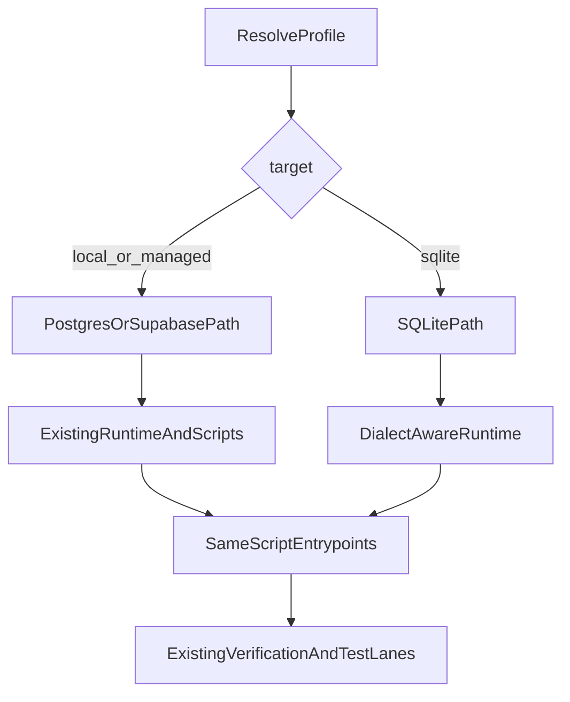

# Add SQLite With Existing Workflows

## Goal
Make SQLite selectable through the existing DB profile mechanism and ensure existing runtime + test + lifecycle commands continue to work (no new shell script entrypoints), while preserving current PostgreSQL/Supabase behavior.

## Scope Alignment
- Keep current entrypoints unchanged: `05_deploy_database.sh`, `97_backup_database.sh`, `98_destroy_database.sh`, `99_restore_database.sh`, `tests/t05_deploy_database_verification_test.sh`, `tests/t06_run_sql_unit_tests.sh`, `src/scripts/run_unit_test_lanes.sh`.
- Add SQLite as a new profile target resolved by the same profile system and env override precedence.
- Implement full runtime support (ingest + classification API), and make existing verification/lifecycle/test flows branch correctly for SQLite.

## Implementation Plan

### 1) Extend DB profile model to represent SQLite
- Update [`/Users/phil/local/src/teller/src/teller/teller_db_profile.py`](/Users/phil/local/src/teller/src/teller/teller_db_profile.py) to support a third target (e.g. `sqlite`) and dialect-specific fields (SQLite file path, optional attach alias handling).
- Preserve existing profile search/override precedence and keep `TELLER_DB_*` env overrides backward compatible.
- Update example profile config in [`/Users/phil/local/src/teller/config/db-profiles-EXAMPLE.json`](/Users/phil/local/src/teller/config/db-profiles-EXAMPLE.json) with a SQLite profile record.
- Update profile export helper [`/Users/phil/local/src/teller/src/scripts/db_profile_export.sh`](/Users/phil/local/src/teller/src/scripts/db_profile_export.sh) so existing scripts can consume either PG or SQLite exports safely.

### 2) Make engine creation dialect-aware
- Refactor [`/Users/phil/local/src/teller/src/teller/teller_db.py`](/Users/phil/local/src/teller/src/teller/teller_db.py):
  - PostgreSQL/Supabase path remains unchanged.
  - SQLite path builds a SQLite SQLAlchemy engine, skips password/sslmode logic, and performs connection initialization required to preserve `teller.*` SQL compatibility (attach/alias strategy).
- Keep `get_engine()`/`get_session()` API stable so callers do not change.

### 3) Add SQLite schema DDL and wire into existing deploy script
- Create SQLite DDL directory parallel to Postgres objects (e.g. [`/Users/phil/local/src/teller/src/sql/sqlite`](/Users/phil/local/src/teller/src/sql/sqlite)) with equivalent table/view/constraint/trigger intent.
- Update existing deploy script [`/Users/phil/local/src/teller/05_deploy_database.sh`](/Users/phil/local/src/teller/05_deploy_database.sh) to branch by resolved profile target:
  - Current Postgres logic unchanged for `local`/`managed`.
  - SQLite path applies SQLite DDL using `sqlite3` (or SQLAlchemy-driven exec), with same script entrypoint and failure semantics.
- Keep requirement IDs/comments aligned in that script and add SQLite-specific requirement statements where needed.

### 4) Make runtime SQL portable for classification + persistence
- Audit and update SQL in:
  - [`/Users/phil/local/src/teller/src/teller/teller_persist.py`](/Users/phil/local/src/teller/src/teller/teller_persist.py)
  - [`/Users/phil/local/src/teller/src/teller/classification/constants.py`](/Users/phil/local/src/teller/src/teller/classification/constants.py)
  - [`/Users/phil/local/src/teller/src/teller/classification/services.py`](/Users/phil/local/src/teller/src/teller/classification/services.py)
- Add dialect-aware SQL fragments for known Postgres-only constructs (e.g., enum casts, `ILIKE`, `NULLS LAST`, catalog assumptions) while preserving behavior contracts.
- Replace hard PostgreSQL enum coupling (`PgEnum`) with dialect-safe SQLAlchemy type usage where necessary.

### 5) Keep existing backup/destroy/restore entrypoints working for SQLite
- Extend existing scripts to support SQLite under same commands:
  - [`/Users/phil/local/src/teller/97_backup_database.sh`](/Users/phil/local/src/teller/97_backup_database.sh): SQLite backup path (file snapshot/copy + metadata) using active profile.
  - [`/Users/phil/local/src/teller/98_destroy_database.sh`](/Users/phil/local/src/teller/98_destroy_database.sh): SQLite teardown path with same confirmation guard.
  - [`/Users/phil/local/src/teller/99_restore_database.sh`](/Users/phil/local/src/teller/99_restore_database.sh): SQLite restore path compatible with existing options where feasible.
- Preserve current Postgres behavior unchanged.

### 6) Extend existing verification and SQL test lanes for SQLite
- Update deploy verification script [`/Users/phil/local/src/teller/tests/t05_deploy_database_verification_test.sh`](/Users/phil/local/src/teller/tests/t05_deploy_database_verification_test.sh) so it validates SQLite equivalents (schema/tables/views/invariants) when SQLite profile is active, while retaining Postgres catalog checks for PG profiles.
- Update SQL lane runner [`/Users/phil/local/src/teller/src/scripts/run_unit_test_lanes.sh`](/Users/phil/local/src/teller/src/scripts/run_unit_test_lanes.sh) and wrapper [`/Users/phil/local/src/teller/tests/t06_run_sql_unit_tests.sh`](/Users/phil/local/src/teller/tests/t06_run_sql_unit_tests.sh) to run SQLite SQL checks via existing lane entrypoints.
- Keep same lane names and top-level test command flow.

### 7) Update Python/unit/property tests for multi-dialect behavior
- Expand tests:
  - [`/Users/phil/local/src/teller/tests/py/test_teller_db_profile.py`](/Users/phil/local/src/teller/tests/py/test_teller_db_profile.py)
  - [`/Users/phil/local/src/teller/tests/py/test_teller_db.py`](/Users/phil/local/src/teller/tests/py/test_teller_db.py)
  - [`/Users/phil/local/src/teller/tests/py/properties/test_teller_db_profile_properties.py`](/Users/phil/local/src/teller/tests/py/properties/test_teller_db_profile_properties.py)
- Add/adjust tests for classification and persistence portability where behavior depends on SQL dialect.

### 8) Requirements and docs alignment
- Update requirements docs to include SQLite support and branching behavior:
  - [`/Users/phil/local/src/teller/requirements/teller/teller_db-requirements.md`](/Users/phil/local/src/teller/requirements/teller/teller_db-requirements.md)
  - [`/Users/phil/local/src/teller/requirements/teller/teller_db_profile-requirements.md`](/Users/phil/local/src/teller/requirements/teller/teller_db_profile-requirements.md)
  - script requirement docs under [`/Users/phil/local/src/teller/requirements`](/Users/phil/local/src/teller/requirements)
- Update operational docs:
  - [`/Users/phil/local/src/teller/README.md`](/Users/phil/local/src/teller/README.md)
  - [`/Users/phil/local/src/teller/Architecture.md`](/Users/phil/local/src/teller/Architecture.md)

## High-Level Flow (Post-change)

## Validation Strategy
- Run existing deploy/test/lifecycle commands under at least one PG profile and one SQLite profile.
- Confirm no regressions in current PG/Supabase paths.
- Confirm SQLite profile supports end-to-end deploy -> ingest/classification runtime -> verification -> backup/destroy/restore via existing commands.