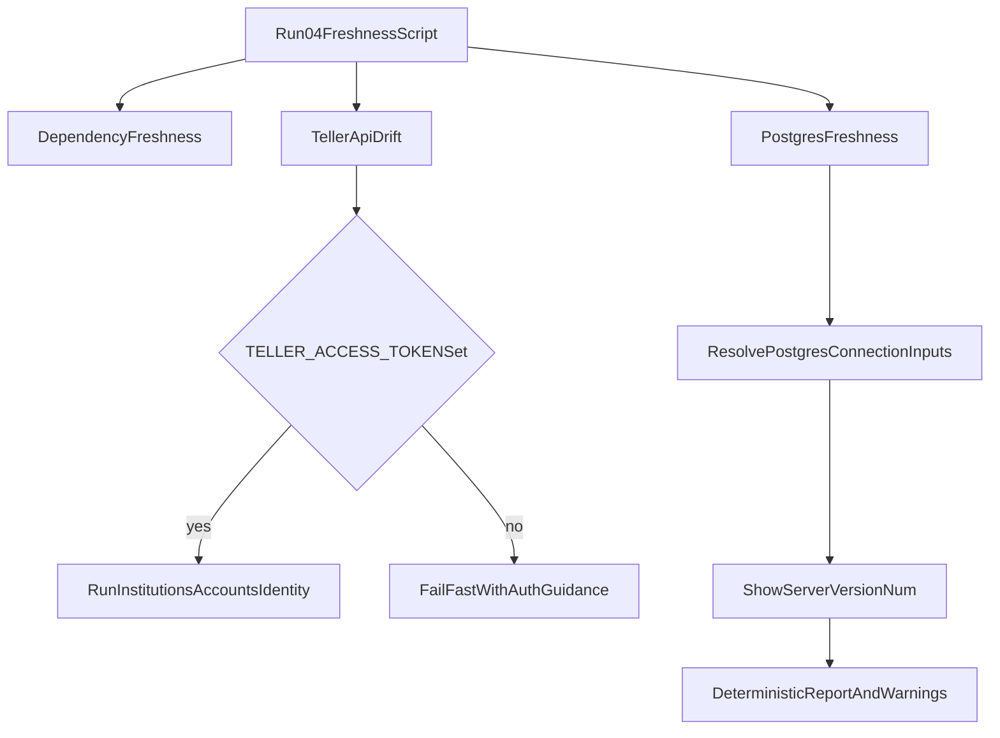

# Address Warnings from Freshness Run

## Goal
Make `./04_run_dependency_freshness_tests.sh` produce actionable output with no ambiguous warnings during normal usage, while preserving safety checks.

## Current warning sources
- Dependency lane reports a transitive update (`pydantic_core`) from [`scripts/check_dependency_freshness.py`](/Users/phil/local/src/teller/scripts/check_dependency_freshness.py).
- Teller drift lane warns on ambiguous local token files and then skips authenticated checks in [`scripts/check_teller_api_drift.py`](/Users/phil/local/src/teller/scripts/check_teller_api_drift.py).
- PostgreSQL lane cannot resolve server version when connection inputs are incomplete in [`scripts/check_postgres_freshness.py`](/Users/phil/local/src/teller/scripts/check_postgres_freshness.py) and wrapper defaults in [`04_run_dependency_freshness_tests.sh`](/Users/phil/local/src/teller/04_run_dependency_freshness_tests.sh).

## Plan
1. **Clarify dependency-warning policy (transitive vs direct)**
   - Keep current gate behavior (fail on direct outdated only) in [`scripts/check_dependency_freshness.py`](/Users/phil/local/src/teller/scripts/check_dependency_freshness.py).
   - Update docs for this check flow to explicitly state that transitive outdated entries are informational unless promoted to direct pins.
   - Add a short operator note to refresh the venv (`pydantic` reinstall/sync) when transitive staleness appears.

2. **Make Teller auth explicit to remove ambiguity warnings**
   - In [`04_run_dependency_freshness_tests.sh`](/Users/phil/local/src/teller/04_run_dependency_freshness_tests.sh), enforce explicit auth input for Teller canary runs:
     - require `TELLER_ACCESS_TOKEN` when `RUN_TELLER_CANARY=true`, or
     - fail fast with a clear remediation message (instead of continuing with ambiguous local token discovery warnings).
   - Optionally keep a bypass toggle for local dev (documented), but default behavior should be explicit token requirement.
   - Update usage docs in [`requirements/04_run_dependency_freshness_tests-requirements.md`](/Users/phil/local/src/teller/requirements/04_run_dependency_freshness_tests-requirements.md).

3. **Keep Postgres server-version check enabled and make it deterministic**
   - Preserve `POSTGRES_CHECK_SERVER_VERSION=true` default in [`04_run_dependency_freshness_tests.sh`](/Users/phil/local/src/teller/04_run_dependency_freshness_tests.sh).
   - Tighten connection configuration guidance and fallback order:
     - prefer explicit `POSTGRES_SERVER_PSQL_ARGS` (or DSN),
     - ensure `PGPASSWORD` resolution path is clear and observable,
     - emit actionable error text including which connection mode was attempted.
   - Add/adjust docs so local and CI setup provide reachable server credentials before this check runs.

4. **Test coverage and regression checks**
   - Extend shell tests in [`tests/sh/04_run_dependency_freshness_tests.bats`](/Users/phil/local/src/teller/tests/sh/04_run_dependency_freshness_tests.bats) for:
     - Teller canary behavior when `TELLER_ACCESS_TOKEN` missing/present,
     - Postgres server-check path with explicit args.
   - Extend Python tests where needed in:
     - [`tests/py/test_check_teller_api_drift.py`](/Users/phil/local/src/teller/tests/py/test_check_teller_api_drift.py)
     - [`tests/py/test_check_postgres_freshness.py`](/Users/phil/local/src/teller/tests/py/test_check_postgres_freshness.py)
   - Verify end-to-end by rerunning `./04_run_dependency_freshness_tests.sh` and confirming warning behavior matches policy.

## Acceptance criteria
- No ambiguous multi-token Teller warning in default workflow; either authenticated checks run or script exits with clear setup instructions.
- PostgreSQL server-version check remains enabled and can pass in configured environments (local/CI) without generic "unknown server version" warning.
- Dependency transitive outdated lines are documented as informational, with clear operator remediation guidance.