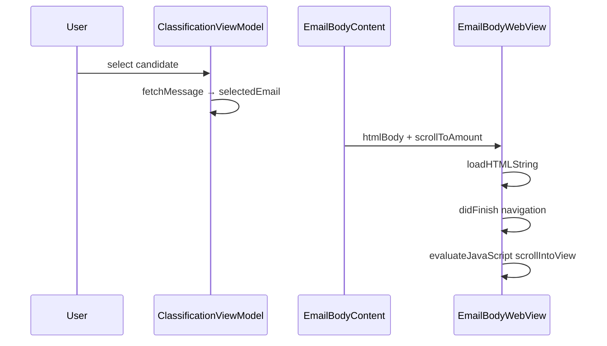

# Auto-scroll candidate body to transaction amount

## Problem

The email body in the right pane ([`ContentView.swift`](macos-ui/Sources/TransactionClassifier/ContentView.swift)) renders Mailcart HTML in a `WKWebView` with no programmatic scroll. Wide receipt layouts (e.g. Sweetgreen "Order Total $15.19") load scrolled to the top-left, cutting off the amount horizontally and vertically.

Today:
- Body loads via `ClassificationViewModel.selectedCandidateDidChange()` → `selectedEmail`
- [`EmailBodyContent`](macos-ui/Sources/TransactionClassifier/ContentView.swift) renders HTML in `EmailBodyWebView` or plain text in a SwiftUI `ScrollView`
- Transaction amount is only shown in the left list (`amountFormatter`); it is **not** passed into the body view
- The only existing programmatic scroll is the transaction list (`.scrollPosition`, #R025)

## Approach

Pass the primary transaction amount into the body renderer and scroll to it **after content loads**. No backend changes — bodies remain passthrough from Mailcart.



### 1. Amount search variants (shared helper)

Add a small private helper in [`ContentView.swift`](macos-ui/Sources/TransactionClassifier/ContentView.swift) (or a tiny new file if preferred) that builds search strings from `Decimal`:

- Use **absolute value** (bank debits are negative; receipts show `$15.19`)
- Include formatted variants from the existing `amountFormatter`: `$15.19`, `$1,234.56`
- Include plain decimal strings: `15.19`, `1234.56`
- Include signed/parenthetical forms: `-$15.19`, `($15.19)`
- Deduplicate and order longest-first to avoid partial matches (e.g. match `$15.19` before `15.1`)

### 2. HTML path (primary) — extend `EmailBodyWebView`

Changes in [`ContentView.swift`](macos-ui/Sources/TransactionClassifier/ContentView.swift) ~lines 714–810:

**Plumbing**
- Add `scrollToAmount: Decimal?` to `EmailBodyContent` and `EmailBodyWebView`
- In `EmailSection`, pass `viewModel.primaryTransaction?.amount`:

```swift
EmailBodyContent(email: email, scrollToAmount: viewModel.primaryTransaction?.amount)
```

**Coordinator + navigation delegate** (mirror [`ConnectView.swift`](macos-ui/Sources/TransactionClassifier/ConnectView.swift) pattern)
- Add `makeCoordinator()` and a `Coordinator: NSObject, WKNavigationDelegate`
- Set `webView.navigationDelegate = context.coordinator` in `makeNSView`
- Store `htmlBody` and `scrollToAmount` on the coordinator; only call `loadHTMLString` when `htmlBody` actually changes (avoids redundant reloads on unrelated SwiftUI updates)

**Scroll on load**
- In `webView(_:didFinish:)`, call `evaluateJavaScript` with an inline script that:
  1. Walks text nodes in `document.body`
  2. Collects elements whose text contains any amount variant
  3. **Prefers the best match**: last occurrence whose surrounding text matches `\b(total|order total|grand total|amount due)\b` (case-insensitive); falls back to the **last** occurrence (totals are usually at the bottom of receipts)
  4. Calls `element.scrollIntoView({ block: 'center', inline: 'center' })` on the chosen element's block-level parent (e.g. `<tr>`, `<td>`, `<p>`)

Native `evaluateJavaScript` works for this even though page JS is disabled (`allowsContentJavaScript = false` only blocks scripts embedded in Mailcart HTML).

**No visual highlight** unless you want it — the request is visibility via scroll only.

### 3. Plain-text fallback — extend text `ScrollView` branch

For `text_body` emails (~lines 721–729):

- Split body into lines; find the best line index using the same total-keyword preference
- Wrap lines in a `ScrollViewReader` + `LazyVStack`, tagging the target line with `.id("teller-amount-line")`
- On appear and when `scrollToAmount` / email changes, `scrollTo("teller-amount-line", anchor: .center)`

### 4. Trigger conditions

Scroll should run when:
- A new candidate body finishes loading (`selectedEmail` changes)
- The primary transaction amount changes while the same email is displayed (rare, but handled by passing `scrollToAmount` into the view)

If no variant matches, leave scroll at default position (top-left).

### 5. Requirements traceability

Add **R035** to [`requirements/macos-ui/ContentView-requirements.md`](requirements/macos-ui/ContentView-requirements.md):

> When a candidate email body loads, scroll the body pane so the selected transaction's amount is visible (centered when possible), including horizontal overflow.

### 6. Tests

| Test | Where | What |
|------|-------|------|
| Unit test for variant generation | New test in `macos-ui/Tests/TransactionClassifierTests/` | `$15.19` debit → variants include `$15.19` and `15.19`; large amounts include comma form |
| Unit test for line selection logic | Same file (extract pure Swift helper) | Given multiline text with subtotal + order total, picks the total line |
| Manual verification | App | Select Sweetgreen candidate; confirm "Order Total $15.19" is centered in the white receipt area |

No snapshot test for scroll position (static snapshots won't capture scroll state). UI automation of `WKWebView` scroll is brittle and out of scope unless requested.

## Files to change

- [`macos-ui/Sources/TransactionClassifier/ContentView.swift`](macos-ui/Sources/TransactionClassifier/ContentView.swift) — main implementation
- [`requirements/macos-ui/ContentView-requirements.md`](requirements/macos-ui/ContentView-requirements.md) — R035
- New unit test file under `macos-ui/Tests/TransactionClassifierTests/` for amount-search helpers

## Out of scope

- Backend / [`teller_classification_api.py`](teller/teller_classification_api.py) changes
- Highlighting or annotating the amount in the rendered HTML
- Candidates list scroll (middle pane)
