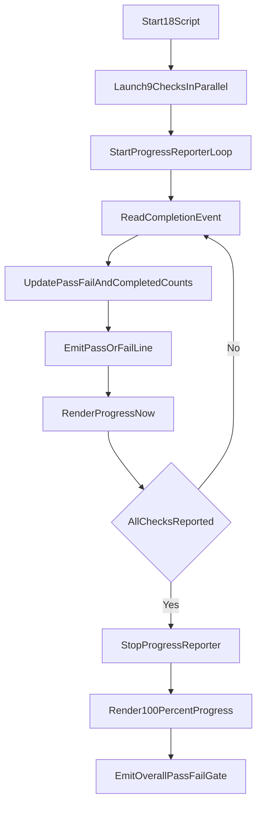

# Add Continuous Progress Bar For 18

## Goal
Implement continuous in-flight progress reporting for `18_run_all_checks_parallel.sh` while preserving existing per-check PASS/FAIL completion lines and final gate behavior.

## Files To Change
- [/Users/phil/local/src/teller/requirements/18_run_all_checks_parallel-requirements.md](/Users/phil/local/src/teller/requirements/18_run_all_checks_parallel-requirements.md)
- [/Users/phil/local/src/teller/tests/sh/18_run_all_checks_parallel.bats](/Users/phil/local/src/teller/tests/sh/18_run_all_checks_parallel.bats)
- [/Users/phil/local/src/teller/18_run_all_checks_parallel.sh](/Users/phil/local/src/teller/18_run_all_checks_parallel.sh)

## Current Baseline To Preserve
The script already streams completion-order results through the FIFO and per-script logs:

```29:55:/Users/phil/local/src/teller/18_run_all_checks_parallel.sh
for script in "${CHECKS[@]}"; do
  log="${REPORT_DIR}/${script%.sh}.log"
  rm -f "${log}" "${log}.exit"
  (
    set +e
    "./${script}" >"${log}" 2>&1
    exit_code=$?
    echo "$exit_code" > "${log}.exit"
    printf '%s|%s\n' "$script" "$exit_code" >&3
  ) &
```

## Implementation Plan
1. **Requirement update**
   - Add a new requirement (e.g., `R045`) describing continuous progress-bar reporting while checks are still running.
   - Define design details: progress format includes completed/total + percentage + visual bar, starts near 0, updates at fixed interval during execution, and finishes at 100% before final summary line.
   - Add explicit test cases under `R045` for in-flight updates and final completion state.

2. **Bats test coverage**
   - Add traceability anchors for new `R045` test IDs in `tests/sh/18_run_all_checks_parallel.bats`.
   - Add a test using staggered child stubs (`sleep` variants) to verify progress output appears before all checks complete (not only at the end).
   - Add a test asserting final rendered progress reaches 100% (or `9/9`) and does not break existing PASS/FAIL summary assertions.
   - Keep existing R025/R030 tests intact so completion-order and gate behavior remain covered.

3. **Script implementation**
   - Introduce a progress-render helper in `18_run_all_checks_parallel.sh` that draws a textual bar (using ASCII-safe characters) plus percentage and counts.
   - Start a lightweight reporter loop (background) that periodically redraws progress while `reported < total`.
   - On each FIFO completion event, keep current PASS/FAIL line emission, update counters, and force a progress refresh so visible progress advances immediately.
   - Cleanly stop the progress loop, print final 100% progress line, then continue to existing overall PASS/FAIL gate output.
   - Ensure terminal formatting remains readable when mixed with completion lines (newline boundaries around redraws).

4. **Verification pass**
   - Run focused shell tests for `18`: `bats tests/sh/18_run_all_checks_parallel.bats`.
   - If needed, rerun only failing cases and adjust output formatting for deterministic assertions.

## Execution Flow (Target)
