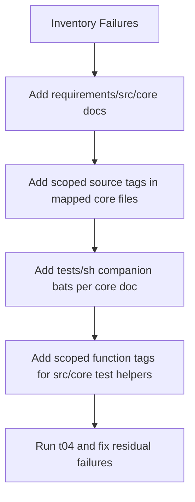

# Enforce Native Traceability for `src/core`

## Goal

Make `./tests/t04_run_requirements_traceability_tests.sh` pass with the stricter policy by fully tracing first-party native code (`C/C++/ObjC`) and related core-owned sources.

## Current Gap (to close)

- Global coverage now includes `src/core` sources, so files under [src/core/include/tellercore](src/core/include/tellercore), [src/core/src](src/core/src), [src/core/tools](src/core/tools), and [src/core/oracle](src/core/oracle) must be doc-mapped.
- Function-tag coverage now includes native code, so functions in those trees (and candidate test helpers in [src/core/tests](src/core/tests)) need scoped `#R...:` tags.

## Implementation Approach (Meaningful Module-Level)

### 1) Build a deterministic core traceability map

- Use current `t04` failure output as the source of truth for uncovered files and untagged functions.
- Group by module stem to keep docs and tests maintainable (per-stem ownership rather than one mega-doc).

### 2) Add module requirements docs under `requirements/src/core/`

Create new docs mirroring existing requirements format (`Scope`, `Rxxx Statement`, `Design`, `Tests`) for stems covering:

- [src/core/src/db.cpp](src/core/src/db.cpp), [src/core/src/db_sqlite.cpp](src/core/src/db_sqlite.cpp), [src/core/src/db_postgres.cpp](src/core/src/db_postgres.cpp), [src/core/include/tellercore/db.hpp](src/core/include/tellercore/db.hpp), [src/core/include/tellercore/db_postgres.hpp](src/core/include/tellercore/db_postgres.hpp), [src/core/include/tellercore/dialect.hpp](src/core/include/tellercore/dialect.hpp)
- [src/core/src/persist.cpp](src/core/src/persist.cpp), [src/core/include/tellercore/persist.hpp](src/core/include/tellercore/persist.hpp)
- [src/core/src/profile.cpp](src/core/src/profile.cpp), [src/core/include/tellercore/profile.hpp](src/core/include/tellercore/profile.hpp)
- [src/core/src/statement.cpp](src/core/src/statement.cpp), [src/core/include/tellercore/statement.hpp](src/core/include/tellercore/statement.hpp)
- [src/core/src/mailcart.cpp](src/core/src/mailcart.cpp), [src/core/include/tellercore/mailcart.hpp](src/core/include/tellercore/mailcart.hpp)
- [src/core/src/json_io.cpp](src/core/src/json_io.cpp), [src/core/include/tellercore/json_io.hpp](src/core/include/tellercore/json_io.hpp)
- [src/core/src/ffi.cpp](src/core/src/ffi.cpp), [src/core/include/tellercore/ffi.h](src/core/include/tellercore/ffi.h), [src/core/include/tellercore/error.hpp](src/core/include/tellercore/error.hpp)
- [src/core/src/onepsa.cpp](src/core/src/onepsa.cpp), [src/core/include/tellercore/onepsa.hpp](src/core/include/tellercore/onepsa.hpp)
- [src/core/src/ocr_backend_apple.mm](src/core/src/ocr_backend_apple.mm), [src/core/src/ocr_backend_win.cpp](src/core/src/ocr_backend_win.cpp), [src/core/include/tellercore/ocr.hpp](src/core/include/tellercore/ocr.hpp)
- [src/core/tools/teller_fetch.cpp](src/core/tools/teller_fetch.cpp), [src/core/tools/teller_backfill.cpp](src/core/tools/teller_backfill.cpp), [src/core/tools/oracle_runner.cpp](src/core/tools/oracle_runner.cpp)
- [src/core/oracle/compare_oracle.py](src/core/oracle/compare_oracle.py), [src/core/oracle/compare_statement_oracle.py](src/core/oracle/compare_statement_oracle.py)

### 3) Add meaningful scoped `#R...:` tags in mapped source files

- Tag each parser-detected function/method with scoped comments tied to the owning module requirements.
- Ensure tags are scoped text form (`#Rxxx: ...`) and avoid header bundle anti-patterns.
- Cover static helpers and private namespace functions too, since function-tag coverage enumerates them.

### 4) Add discovered companion tests for each new core requirements doc

- Add [tests/sh](tests/sh) `*.bats` companions with stem names matching new requirements docs.
- In each `@test`, add `#Rxxx:` and numbered `#Rxxx-Tnn:` tags inside executable test blocks.
- Keep tests deterministic (structure/invariant checks and lane-level behavior probes) so they are stable in local CI.

### 5) Satisfy function-tag coverage for `src/core/tests` candidates

- Add scoped requirement tags to functions in [src/core/tests/fixture.cpp](src/core/tests/fixture.cpp), [src/core/tests/fixture.hpp](src/core/tests/fixture.hpp), [src/core/tests/test_persist.cpp](src/core/tests/test_persist.cpp), [src/core/tests/test_profile.cpp](src/core/tests/test_profile.cpp), [src/core/tests/test_statement.cpp](src/core/tests/test_statement.cpp) and any other remaining untagged candidates.
- Keep these tags scoped and consistent with module intent to avoid “compliance-only” anchors.

### 6) Verify and converge

- Run `./tests/t04_run_requirements_traceability_tests.sh` repeatedly until:
  - no uncovered repository software files
  - no function-tag-coverage failures
  - all new requirements docs pass strict/source/test/numbered checks
- Run `tests/t15`-`tests/t18` lanes as smoke validation that traceability-only edits did not perturb core behavior.

## Success Criteria

- `t04` returns pass with zero `repository software files missing requirements coverage` failures and zero `function-tag-coverage` failures for first-party native paths.
- New core requirements/docs/tests are maintainable and module-scoped, not a single aggregated compliance bundle.

