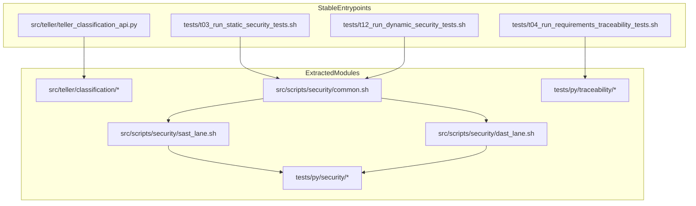

# Aggressive Monolith Decomposition Plan

## Objectives

- Split `[src/teller/teller_classification_api.py](src/teller/teller_classification_api.py)` into cohesive modules without changing API behavior.
- Split `[tests/t03_run_static_security_tests.sh](tests/t03_run_static_security_tests.sh)`, `[tests/t04_run_requirements_traceability_tests.sh](tests/t04_run_requirements_traceability_tests.sh)`, and `[tests/t12_run_dynamic_security_tests.sh](tests/t12_run_dynamic_security_tests.sh)` into reusable helpers.
- Keep operator-facing script entrypoints and test invocation paths stable.
- Update requirements docs and traceability tags so `[tests/t04_run_requirements_traceability_tests.sh](tests/t04_run_requirements_traceability_tests.sh)` remains green.

## Target Shape

- Keep compatibility facade at `[src/teller/teller_classification_api.py](src/teller/teller_classification_api.py)` while moving internals into `src/teller/classification/` modules (constants/text/schemas/sql/auth/services/mailcart/routes/app).
- Keep `tests/tNN_*.sh` wrappers as orchestration entrypoints; move heavy logic into:
  - `src/scripts/security/common.sh`
  - `src/scripts/security/sast_lane.sh`
  - `src/scripts/security/dast_lane.sh`
  - `tests/py/security/*.py`
  - `tests/py/traceability/*.py`

## Implementation Phases

### Phase 1: API internal extraction with facade compatibility

- Create `src/teller/classification/` modules in this order: utilities/constants -> SQL/tables -> schemas -> auth -> services (categories/classifications/matches/mailcart) -> route registration -> app factory.
- Keep `[src/teller/teller_classification_api.py](src/teller/teller_classification_api.py)` as a thin compatibility layer exporting `create_app` and required test patch points.
- Update `[pyproject.toml](pyproject.toml)` package discovery/mutation target settings for new module paths.

### Phase 2: Security test lane decomposition (t03/t12)

- Extract duplicated shell primitives from `[tests/t03_run_static_security_tests.sh](tests/t03_run_static_security_tests.sh)` and `[tests/t12_run_dynamic_security_tests.sh](tests/t12_run_dynamic_security_tests.sh)` into shared security scripts.
- Extract embedded Python blocks into `tests/py/security/` modules (SAST summary/gate, category integrity checks, Schemathesis fixture prep, delete-category contract checks, ZAP summary parsing).
- Make t03 a true SAST orchestrator and t12 the canonical DAST orchestrator while preserving env knobs and artifact locations.

### Phase 3: Traceability engine decomposition (t04)

- Convert large inline parsers in `[tests/t04_run_requirements_traceability_tests.sh](tests/t04_run_requirements_traceability_tests.sh)` into `tests/py/traceability/` modules (discovery, tag parsing, requirement-test mapping, verification).
- Keep the shell script as a thin CLI wrapper around the Python verification modules.
- Add focused Python tests for parser/mapper logic to reduce reliance on full-repo t04 runs during iteration.

### Phase 4: Requirements + architecture synchronization

- Update existing requirement docs:
  - `[requirements/t03_run_static_security_tests-requirements.md](requirements/t03_run_static_security_tests-requirements.md)`
  - `[requirements/t04_run_requirements_traceability_tests-requirements.md](requirements/t04_run_requirements_traceability_tests-requirements.md)`
  - `[requirements/t12_run_dynamic_security_tests-requirements.md](requirements/t12_run_dynamic_security_tests-requirements.md)`
  - `[requirements/teller/teller_classification_api-requirements.md](requirements/teller/teller_classification_api-requirements.md)`
  - `[Architecture.md](Architecture.md)`
- Add new requirements docs for extracted helper modules (security lanes and traceability/security Python helpers), including explicit ownership boundaries and `Rxxx-T##` bullets.
- Ensure new helper source files include scoped `#Rxxx:` tags and corresponding test IDs to satisfy t04 numbered-traceability checks.

### Phase 5: Validation sequence

- Validate in increasing blast radius:
  1. Python tests that touch extracted classification helpers and route behavior
  2. `tests/sh/*` Bats suites for t03/t04/t12
  3. `tests/t04_run_requirements_traceability_tests.sh` (strict mode)
  4. `tests/t03_run_static_security_tests.sh` and `tests/t12_run_dynamic_security_tests.sh`
- Confirm stable external contracts: API route surface, auth header behavior, artifact outputs, and CI invocation paths.

## Key Risk Controls

- Preserve import and patch compatibility via API facade until all dependent tests are migrated.
- Keep shell entrypoint filenames unchanged to avoid parallel runner and docs breakage.
- Centralize one canonical category-integrity implementation to prevent t03/t12 drift.
- Treat requirements traceability updates as first-class in every extraction step (avoid late “doc-only” catch-up).

