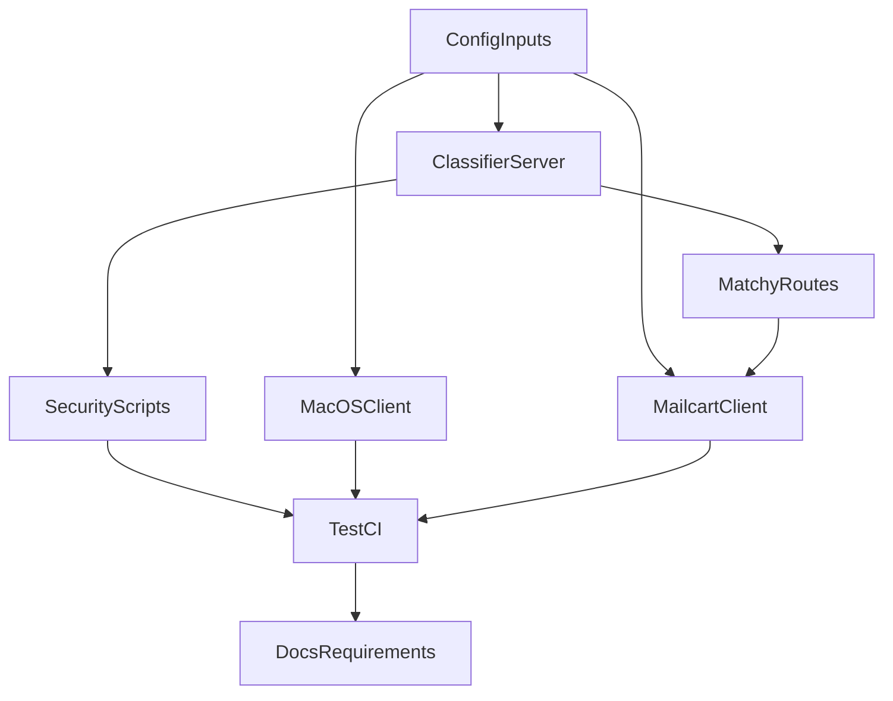

# Enforce HTTPS Everywhere

## Objective
Make the repository HTTPS-only end to end: no runtime HTTP fallback, no HTTP defaults, and no tests/docs that treat HTTP as valid behavior. Keep only negative tests that verify HTTP inputs are rejected.

## Scope Confirmed
- Enforce HTTPS for **all** relevant traffic in this repo.
- Remove HTTP-positive behavior from runtime code, scripts, CI defaults, and requirements/docs.
- Keep negative tests that assert `http://...` is rejected.

## Implementation Plan

### 1) Remove classifier HTTP fallback and validate URL schemes
- Update [`/Users/phil/local/src/teller/08_run_classification_api.py`](/Users/phil/local/src/teller/08_run_classification_api.py) to remove `TELLER_CLASSIFIER_ALLOW_INSECURE_HTTP` behavior and require TLS startup.
- Update [`/Users/phil/local/src/teller/src/macos-ui/Sources/TransactionClassifier/APIClient.swift`](/Users/phil/local/src/teller/src/macos-ui/Sources/TransactionClassifier/APIClient.swift):
  - always default to `https://127.0.0.1:8787`.
  - reject `TELLER_CLASSIFIER_API_URL` if scheme is `http` (fail fast with clear error).
- Update any helper paths that currently route via HTTP assumptions (including launch env handling in UI test harnesses where needed).

### 2) Enforce HTTPS-only for Teller -> Mailcart
- Update [`/Users/phil/local/src/teller/src/teller/teller_mailcart_client.py`](/Users/phil/local/src/teller/src/teller/teller_mailcart_client.py):
  - remove HTTP default base URL.
  - enforce scheme validation (`https` only) for configured Mailcart base URL.
  - reject misconfigured/missing URL in a way the `/v1/matchy/*` handlers can surface as service-unavailable/configuration error.
- Align matchy proxy route behavior in [`/Users/phil/local/src/teller/src/teller/classification/app.py`](/Users/phil/local/src/teller/src/teller/classification/app.py) and enrichment helpers in [`/Users/phil/local/src/teller/src/teller/classification/mailcart.py`](/Users/phil/local/src/teller/src/teller/classification/mailcart.py) so invalid Mailcart transport config yields deterministic API errors.

### 3) Remove HTTP defaults from security/test scripts and CI orchestration
- Convert script defaults and probes from `http://` to `https://` in:
  - [`/Users/phil/local/src/teller/src/scripts/security/run_dynamic_security_lane.sh`](/Users/phil/local/src/teller/src/scripts/security/run_dynamic_security_lane.sh)
  - [`/Users/phil/local/src/teller/src/scripts/security/run_static_security_lane.sh`](/Users/phil/local/src/teller/src/scripts/security/run_static_security_lane.sh)
  - [`/Users/phil/local/src/teller/src/scripts/security/common.sh`](/Users/phil/local/src/teller/src/scripts/security/common.sh)
- Update parallel and persistence runners to HTTPS defaults and remove insecure propagation:
  - [`/Users/phil/local/src/teller/10_run_all_tests_parallel.sh`](/Users/phil/local/src/teller/10_run_all_tests_parallel.sh)
  - [`/Users/phil/local/src/teller/tests/t16_classification_persistence_verification_test.sh`](/Users/phil/local/src/teller/tests/t16_classification_persistence_verification_test.sh)

### 4) Rewrite tests to assert HTTP rejection (not acceptance)
- Replace HTTP-positive expectations with HTTPS defaults in shell/python/swift tests:
  - [`/Users/phil/local/src/teller/tests/sh/08_run_classification_api.bats`](/Users/phil/local/src/teller/tests/sh/08_run_classification_api.bats)
  - [`/Users/phil/local/src/teller/tests/sh/10_run_all_tests_parallel.bats`](/Users/phil/local/src/teller/tests/sh/10_run_all_tests_parallel.bats)
  - [`/Users/phil/local/src/teller/tests/sh/t16_classification_persistence_verification_test.bats`](/Users/phil/local/src/teller/tests/sh/t16_classification_persistence_verification_test.bats)
  - [`/Users/phil/local/src/teller/tests/py/test_teller_mailcart_client.py`](/Users/phil/local/src/teller/tests/py/test_teller_mailcart_client.py)
  - [`/Users/phil/local/src/teller/tests/py/test_frontend_backend_contract_scenarios.py`](/Users/phil/local/src/teller/tests/py/test_frontend_backend_contract_scenarios.py)
  - [`/Users/phil/local/src/teller/src/macos-ui/Tests/TransactionClassifierTests/APIClientTests.swift`](/Users/phil/local/src/teller/src/macos-ui/Tests/TransactionClassifierTests/APIClientTests.swift)
- Add explicit negative tests that `http://...` values are rejected for both classifier base URL and Mailcart base URL parsing.

### 5) Update requirements/docs to remove HTTP-as-valid guidance
- Update requirements/docs to match HTTPS-only behavior:
  - [`/Users/phil/local/src/teller/requirements/08_run_classification_api-requirements.md`](/Users/phil/local/src/teller/requirements/08_run_classification_api-requirements.md)
  - [`/Users/phil/local/src/teller/requirements/macos-ui/APIClient-requirements.md`](/Users/phil/local/src/teller/requirements/macos-ui/APIClient-requirements.md)
  - [`/Users/phil/local/src/teller/requirements/teller/teller_classification_api-requirements.md`](/Users/phil/local/src/teller/requirements/teller/teller_classification_api-requirements.md)
  - [`/Users/phil/local/src/teller/src/macos-ui/README.md`](/Users/phil/local/src/teller/src/macos-ui/README.md)
  - [`/Users/phil/local/src/teller/README.md`](/Users/phil/local/src/teller/README.md)
  - [`/Users/phil/local/src/teller/Architecture.md`](/Users/phil/local/src/teller/Architecture.md)
- Fix any stale bootstrap references (e.g., ensure TLS setup script names are accurate).

### 6) Validate with focused test lanes
- Run targeted suites after changes:
  - classifier launcher tests
  - Mailcart client/unit API tests
  - macOS API client tests
  - persistence + security lane smoke checks
- Confirm no remaining HTTP defaults/usages in runtime config paths via repository search.

## Rollout Notes
- This is a breaking security hardening: local setups must have TLS cert/key and HTTPS endpoints available.
- If any external dependency still only serves HTTP (especially Mailcart in local/dev), it must be upgraded/configured for TLS before this lands.

