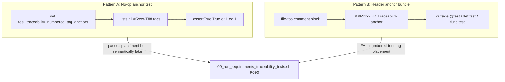

# Fix Traceability Cheating Repo-Wide

## What the last commit fixed

Commit `edbdd389` corrected cheating in [`tests/py/test_teller_object.py`](tests/py/test_teller_object.py):

- **Removed** `TraceabilityTagPlacementTests.test_traceability_numbered_tag_anchors` — a no-op test (`self.assertTrue(True)`) that collected every `#Rxxx-T##` tag without exercising anything.
- **Moved** each numbered tag onto the real `def test_*` method that validates that requirement (using the matching `Tests:` bullet in [`requirements/teller/teller_object-requirements.md`](requirements/teller/teller_object-requirements.md)).

That is the template for all remaining fixes.

## Two cheating patterns still in the repo



| Pattern | Where | Verifier today | Fix |
|---------|-------|----------------|-----|
| A — no-op anchor test | 4 Python teller tests + 1 bats meta-test | Passes (tags are inside a test function) | Delete anchor; move tags to real tests |
| B — header anchor bundle | ~40 bats, 9 Swift, 9 Python script tests | **Fails** R090 placement (49 requirement docs) | Delete header block; add tags inside executable tests |

Running `./00_run_requirements_traceability_tests.sh` today: **49** `FAIL (numbered-test-tag-placement)` groups, plus unrelated gaps for `26_report_quality_trends.sh` / `27_validate_quality_target.sh` (missing requirements docs — not cheating).

## Affected files

### Pattern A — no-op Python anchor tests (4 files)

Same structure as the old `test_teller_object.py` anchor:

- [`tests/py/test_teller_db.py`](tests/py/test_teller_db.py) — anchor holds R025-T01…R040-T02; real tests already exercise these via `#R025`…`#R040` comments
- [`tests/py/test_teller_db_profile.py`](tests/py/test_teller_db_profile.py) — anchor holds R001-T01…R020-T02
- [`tests/py/test_teller_persist.py`](tests/py/test_teller_persist.py) — anchor holds R001-T01…R040-T02
- [`tests/py/test_teller_classification_api.py`](tests/py/test_teller_classification_api.py) — `ClassificationApiTests.test_traceability_numbered_tag_anchors` holds ~35 tags; many real tests already have `#Rxxx` and some already have numbered tags (e.g. `#R060-T01`, `#R062-T03`)

Also Pattern A in bats (meta, not yet failing placement):

- [`tests/sh/00_run_requirements_traceability_tests.bats`](tests/sh/00_run_requirements_traceability_tests.bats) — `@test "Traceability tags for verifier requirements"` bundles R001-T01…R090-T08 with `[ 1 -eq 1 ]` while sibling `@test` blocks already exercise each behavior

### Pattern B — header `# #Rxxx-T##` anchors (~58 files)

**Bats (~40 files)** — all under [`tests/sh/`](tests/sh/), including numbered pipeline scripts (`01_`…`25_`), SQL/script companions (`create_audit.bats`, `run_unit_test_lanes.bats`, etc.). Two sub-cases:

1. **Duplicate headers** — tags already inside `@test` blocks (e.g. [`tests/sh/14_run_fuzz_tests.bats`](tests/sh/14_run_fuzz_tests.bats)): remove header only.
2. **Header-only numbered tags** — `@test` blocks have unnumbered `#Rxxx` only (e.g. [`tests/sh/08_deploy_database.bats`](tests/sh/08_deploy_database.bats), [`tests/sh/04_bootstrap_local_classifier_tls.bats`](tests/sh/04_bootstrap_local_classifier_tls.bats)): remove header and upgrade `#R001` → `#R001-T01` (add `-T02` where requirements define a second bullet).

**Python script tests (9 files)** — module-level `# #Rxxx-T##` comments before `class …Tests`:

- `test_check_dependency_freshness.py`, `test_check_postgres_freshness.py`, `test_check_teller_api_drift.py`, `test_check_teller_api_version_freshness.py`
- `test_dast_baseline.py`, `test_dast_baseline_cleanup.py`, `test_dast_cleanup.py`
- `test_mutmut_darwin.py`, `test_mutmut_darwin_stub.py`

Each already has real tests tagged `#R001` / `#R005` / `#R010`; add `-T01` inside the matching `def test_*`.

**Swift macOS UI tests (9 files)** — file-top `// #Rxxx-T##: Traceability anchor.` blocks:

- Model tests: `APIClientTests.swift`, `ConnectAPIClientTests.swift`, `ConnectViewModelTests.swift`, `ClassificationViewModelTests.swift`, `TellerSetupServiceTests.swift`, `ContentViewRequirementsTests.swift`, `ContentViewSnapshotTests.swift`, `EmailAmountScrollSupportTests.swift`
- UI lane: `TransactionClassifierUITests.swift`

Most already have `#Rxxx` inside `func test*`; add numbered suffixes and remove headers. [`ContentViewRequirementsTests.swift`](src/macos-ui/Tests/TransactionClassifierTests/ContentViewRequirementsTests.swift) already has in-body numbered tags — header removal only.

## Fix methodology (repeat per file)

For each requirements doc + companion test file pair:

1. **Read** the `Tests:` bullets in the matching `requirements/**/*-requirements.md` (each bullet is `Rxxx-T##: description`).
2. **Find** the executable test whose assertions match that bullet (same approach as teller_object: e.g. `test_env_password_wins` → R025-T01).
3. **Add** `#Rxxx-T##` (or `// #Rxxx-T##` in Swift) as the first tag line inside that test body.
4. **Remove** the anchor test or header comment block.
5. **When one test covers multiple bullets**, put multiple numbered tags in that test (as teller_object does for R015/R020/R025 in `test_init_with_api_payload`).
6. **When a T02 bullet exists**, map it to the `@test`/`def test_*` that exercises the second scenario (e.g. `01_install_prerequisites.bats` T02 tags like R012-T02 → git-missing path, R015-T02 → PATH resolution after install).

Do **not** add new no-op tests or leave tags in file headers, `setup()`, or class-level comments — R090 only counts tags inside `@test { … }`, `def test_*`, or `func test*`.

## Suggested execution order

1. **Python teller modules (4 files)** — smallest, exact template from last commit; unblocks 4 requirements docs immediately.
2. **Python script tests (9 files)** — mechanical: 3 tests each, header → method body.
3. **Bats with duplicate headers first** (~10 files like `14_run_fuzz_tests.bats`) — quick wins (delete headers).
4. **Remaining bats (~30 files)** — per-file mapping from requirements doc; largest volume.
5. **Swift tests (9 files)** — same mapping logic as bats.
6. **`00_run_requirements_traceability_tests.bats`** — distribute R001-T01…R090-T08 from the no-op `@test` onto the existing behavioral `@test` blocks (e.g. R090-T07 → `"fails when numbered tags are in test-file header comments"`, R001-T01 → `"prints usage with --help"`).

## Verification

After each batch (or at end):

```bash
./00_run_requirements_traceability_tests.sh
```

Success criteria for this task:

- Zero `FAIL (numbered-test-tag-placement)` errors
- Zero `TraceabilityTagPlacementTests` / `test_traceability_numbered_tag_anchors` / `Traceability anchor` header blocks in test sources
- All `PASS (numbered-test-tags)` for enforceable requirements docs

Optional follow-up (out of scope for cheating fix): add requirements docs for `26_report_quality_trends.sh` and `27_validate_quality_target.sh` — these fail R040/R085 for a different reason.

## Reference: teller_object fix shape

```python
# BEFORE (cheating)
class TraceabilityTagPlacementTests(unittest.TestCase):
    def test_traceability_numbered_tag_anchors(self):
        #R001-T01
        ...
        self.assertTrue(True)

# AFTER (correct)
def test_timestamp_mixin_fields_exist_with_configured_defaults(self):
    #R001-T01
    #R001-T02
    row = TellerTransactionDetails()
    ...
```

Same transformation everywhere else.
