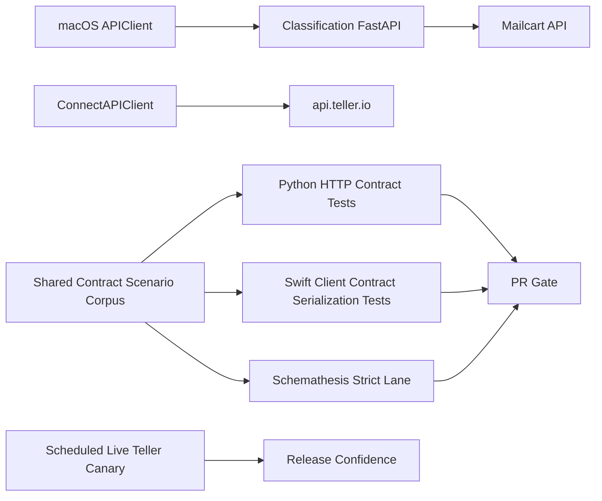

# Frontend-Backend Contract Test Hardening (Strict Gate)

## Goal

Eliminate false confidence by making contract mismatches fail fast in CI for first-party APIs and local integration boundaries, while enforcing upstream Teller compatibility through deterministic PR checks plus scheduled live canaries.

## Scope Confirmed

- Include first-party backend endpoints and frontend callers.
- Include integration wrappers (Mailcart + Teller upstream).
- Strict now in PRs.
- Hybrid external policy:
  - PR strict: local/controlled contracts.
  - Scheduled strict canary: live Teller upstream behavior.

## Current Gaps To Close

- UI regression suite is fixture-driven and does not prove classifier HTTP contract compatibility.
- Python tests in [tests/py/test_teller_classification_api.py](/Users/phil/local/src/teller/tests/py/test_teller_classification_api.py) include direct endpoint invocation patterns that can miss FastAPI request-binding behavior.
- Dynamic contract scenario lane soft-fails on Schemathesis findings in [src/scripts/security/run_dynamic_security_lane.sh](/Users/phil/local/src/teller/src/scripts/security/run_dynamic_security_lane.sh).
- PR-fast path in [README.md](/Users/phil/local/src/teller/README.md) does not currently enforce contract scenarios.

## Contract Architecture (Target)

## Implementation Plan

### 1) Define canonical contract scenario corpus

- Add a versioned scenario corpus for classifier + mailcart proxy + connect/teller identity contracts (request shape, required/optional fields, expected status, response shape invariants).
- Store under test assets (Python-readable + Swift-readable) to avoid duplicated assumptions.
- Primary files to introduce/update:
  - [tests/py/security](/Users/phil/local/src/teller/tests/py/security)
  - [src/macos-ui/Tests/TransactionClassifierTests](/Users/phil/local/src/teller/src/macos-ui/Tests/TransactionClassifierTests)

### 2) Upgrade backend contract tests to HTTP-boundary-first (t08)

- In [tests/py/test_teller_classification_api.py](/Users/phil/local/src/teller/tests/py/test_teller_classification_api.py), add/expand `TestClient` contract tests for all frontend-used classifier endpoints:
  - strict query handling
  - date-only and filter-only search scenarios
  - request/response schema invariants
  - auth/error shape expectations
- Keep direct-function unit tests where useful, but mark them as logic-only; make HTTP contract cases authoritative for API behavior.
- Ensure these run in [tests/t08_run_python_unit_tests.sh](/Users/phil/local/src/teller/tests/t08_run_python_unit_tests.sh) without extra flags.

### 3) Add frontend contract conformance checks (Swift)

- Extend [src/macos-ui/Tests/TransactionClassifierTests/APIClientTests.swift](/Users/phil/local/src/teller/src/macos-ui/Tests/TransactionClassifierTests/APIClientTests.swift) to validate full query/body serialization against the shared corpus (especially advanced filters and match/email endpoints).
- Add fixture-vs-real contract conformance tests for `ClassificationAPI` implementations where feasible, so fixture behavior cannot silently diverge from backend contract assumptions.
- Update fixture implementations in:
  - [src/macos-ui/Sources/TransactionClassifier/UITestingFixtureClassificationAPI.swift](/Users/phil/local/src/teller/src/macos-ui/Sources/TransactionClassifier/UITestingFixtureClassificationAPI.swift)
  - [src/macos-ui/Sources/TransactionClassifier/UITestingFixtureConnectAPI.swift](/Users/phil/local/src/teller/src/macos-ui/Sources/TransactionClassifier/UITestingFixtureConnectAPI.swift)

### 4) Make dynamic contract lane hard-fail (strict now)

- Change Schemathesis findings (`exit 1`) from warning to failure in:
  - [src/scripts/security/run_dynamic_security_lane.sh](/Users/phil/local/src/teller/src/scripts/security/run_dynamic_security_lane.sh)
- Align any mirrored behavior in:
  - [src/scripts/security/run_static_security_lane.sh](/Users/phil/local/src/teller/src/scripts/security/run_static_security_lane.sh)
- Update shell/bats expectations:
  - [tests/sh/t12_run_dynamic_security_tests.bats](/Users/phil/local/src/teller/tests/sh/t12_run_dynamic_security_tests.bats)
  - [tests/sh/t03_run_static_security_tests.bats](/Users/phil/local/src/teller/tests/sh/t03_run_static_security_tests.bats)

### 5) Wire strict contract checks into PR profile

- Update PR-fast guidance and scripts so contract scenarios are mandatory on PRs:
  - [README.md](/Users/phil/local/src/teller/README.md)
  - optional profile script updates in [10_run_all_tests_parallel.sh](/Users/phil/local/src/teller/10_run_all_tests_parallel.sh) and/or lane wrappers.
- Ensure `t08 + t10 + t12` collectively gate merges for contract regressions.

### 6) Hybrid external-integration enforcement

- PR strict (deterministic):
  - Mailcart-proxied behavior validated against local/stubbed controlled responses.
  - Teller upstream contract validated via schema/shape drift checks and deterministic fixture corpus.
- Scheduled live canary (strict but non-PR-blocking):
  - run live `api.teller.io` checks with authenticated contexts;
  - fail canary on contract drift; surface alerts and required remediation.
- Primary files:
  - [tests/t13_run_teller_api_smoke_tests.sh](/Users/phil/local/src/teller/tests/t13_run_teller_api_smoke_tests.sh)
  - [src/scripts/check_teller_api_drift.py](/Users/phil/local/src/teller/src/scripts/check_teller_api_drift.py)

### 7) Requirements + traceability alignment

- Add/adjust requirements so strict contract behavior is explicit and testable:
  - [requirements/teller/teller_classification_api-requirements.md](/Users/phil/local/src/teller/requirements/teller/teller_classification_api-requirements.md)
  - [requirements/macos-ui/APIClient-requirements.md](/Users/phil/local/src/teller/requirements/macos-ui/APIClient-requirements.md)
  - [requirements/t12_run_dynamic_security_tests-requirements.md](/Users/phil/local/src/teller/requirements/t12_run_dynamic_security_tests-requirements.md)
- Keep [tests/t04_run_requirements_traceability_tests.sh](/Users/phil/local/src/teller/tests/t04_run_requirements_traceability_tests.sh) green by adding matching anchors/tests.

## Acceptance Criteria

- PR fails if any frontend-used classifier contract scenario regresses.
- Date-only and advanced-filter scenarios are explicitly covered across backend HTTP tests and frontend serialization tests.
- Schemathesis findings fail `t12`.
- Fixture API conformance checks prevent silent divergence from contract expectations.
- External Teller live drift is continuously monitored via scheduled strict canary with actionable artifacts.

