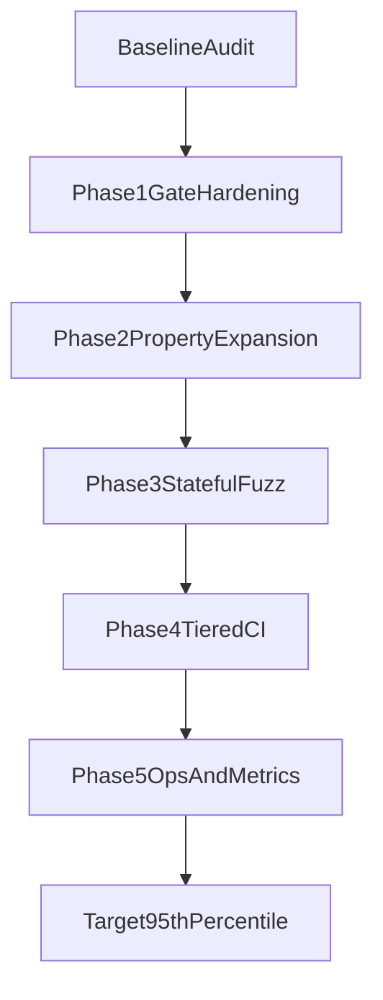

# Fuzz Quality to 95th Percentile

## Goals

- Make fuzz results trustworthy (declared budgets must match effective execution).
- Scale from 2 helper properties to broad invariant + stateful fuzz coverage.
- Establish PR-fast and nightly-deep fuzz tiers with clear pass/fail gates.

## Current Baseline (validated)

- Dedicated fuzz lane is in [13_run_fuzz_tests.sh](13_run_fuzz_tests.sh), but defaults effectively disable budget gating (`FUZZ_MIN_PROPERTY_TESTS=0`, `FUZZ_MIN_TOTAL_EXAMPLES=0`).
- Property coverage is currently limited to [tests/py/test_teller_properties.py](tests/py/test_teller_properties.py) with 2 tests.
- API contract fuzzing exists in [22_run_dynamic_security_tests.sh](22_run_dynamic_security_tests.sh) via Schemathesis, and both lanes are included by [24_run_all_tests_parallel.sh](24_run_all_tests_parallel.sh).

## Phased Roadmap

### Phase 1: Trustworthy Gate Foundation (Week 1)

- Harden [13_run_fuzz_tests.sh](13_run_fuzz_tests.sh):
  - Set non-zero default floor gates (`FUZZ_MIN_PROPERTY_TESTS`, `FUZZ_MIN_TOTAL_EXAMPLES`).
  - Ensure reported budget equals effective budget (Hypothesis runtime settings must be verifiable).
  - Scope default target away from all of `tests/py` to property-focused paths.
  - Improve summary counting to identify true property tests (not generic `test_*` matches).
- Strengthen lane contract tests in [tests/sh/13_run_fuzz_tests.bats](tests/sh/13_run_fuzz_tests.bats):
  - Add real assertions for timeout failure, budget failure, and pytest failure handling.
  - Add assertions for summary correctness and gate-failure semantics.
- Update requirements in [requirements/13_run_fuzz_tests-requirements.md](requirements/13_run_fuzz_tests-requirements.md) so test expectations match hardened behavior.

### Phase 2: Expand Property Coverage (Weeks 1-3)

- Grow `@given` coverage in [tests/py/test_teller_properties.py](tests/py/test_teller_properties.py), then split into a dedicated property suite folder (for scale and ownership).
- Prioritize high-yield invariants in [src/teller/teller_classification_api.py](src/teller/teller_classification_api.py):
  - `_normalize_text`, `_validate_text_field`, `_category_params`, `_display_label`, message-id validators.
  - Invariants: idempotence, normalization consistency, reject/accept partitions, no malformed labels.
- Add property tests for data/model behavior in:
  - [src/teller/teller_persist.py](src/teller/teller_persist.py) (transaction canonicalization invariants)
  - [src/teller/teller_db_profile.py](src/teller/teller_db_profile.py) (profile/env normalization invariants)

### Phase 3: Stateful/Model-Based Fuzzing (Weeks 2-5)

- Introduce Hypothesis state machines for lifecycle correctness in [src/teller/teller_classification_api.py](src/teller/teller_classification_api.py):
  - Match state transitions (`confirm`/`override`/`no-email`/`clear`).
  - Category write/update/delete rules and conflict behaviors.
- Add transition-coverage counters in fuzz summary output to verify state-space exercise depth.

### Phase 4: Tiered CI Execution (Weeks 3-6)

- Define execution profiles using existing knobs in [13_run_fuzz_tests.sh](13_run_fuzz_tests.sh) and [22_run_dynamic_security_tests.sh](22_run_dynamic_security_tests.sh):
  - PR profile: lower example budgets, deterministic seeds, faster runtime.
  - Nightly profile: high example budgets, expanded API fuzz depth (`SCHEMATHESIS_MAX_EXAMPLES`), keep cleanup/integrity gates strict.
- Document profile usage and env knobs in [README.md](README.md).
- Ensure [24_run_all_tests_parallel.sh](24_run_all_tests_parallel.sh) behavior is documented for both profiles.

### Phase 5: Fuzz Ops and Regression Loop (Weeks 4-8)

- Persist replayable failing examples/seeds under `artifacts/fuzz` conventions.
- Add machine-readable metrics to `fuzz-summary.json` for trend tracking.
- Establish promotion criteria: no sustained fuzz flake, stable budgets, increasing invariant/state coverage.

## Quality Metrics and Thresholds

- Property test count: target >= 12 (Phase 2), then >= 25 (Phase 3+).
- Total passing examples: enforce non-zero PR floor; nightly significantly higher.
- Invalid example ratio: track and cap (strategy quality signal).
- Stateful transition coverage: target >= 90% of legal transitions for modeled workflows.
- Reproducibility: deterministic seeds in PR; seed rotation policy in nightly.

## Delivery Flow

## Risks and Mitigations

- Runtime blowups as property/stateful tests grow: mitigate with tiered PR/nightly budgets and scoped paths.
- False confidence from weak counters: mitigate by parsing true Hypothesis/statemachine outputs only.
- Flakiness from nondeterminism: mitigate with deterministic PR seeds and replay artifact capture.

## Acceptance Criteria

- Hardened fuzz lane fails correctly on timeout, budget shortfall, and property regressions.
- Property suite expanded to multi-module invariants and stateful transition tests.
- PR and nightly fuzz profiles documented and consistently runnable.
- Metrics demonstrate sustained, measurable fuzz-depth growth toward top-tier quality.

