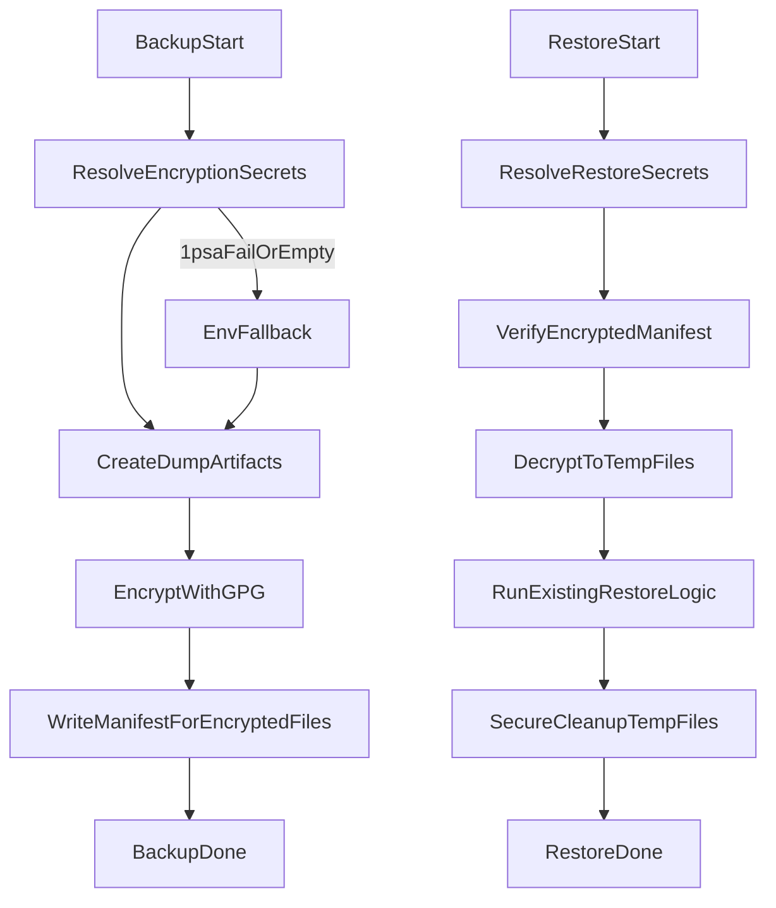

# GPG Backup Encryption Plan

## Goal

Encrypt backup artifacts at rest using GPG asymmetric crypto, keep existing backup/restore behavior, and add a resilient secret-resolution path (`1psa` first, `.env` fallback).

## Scope

- Update backup to emit encrypted artifacts instead of plaintext `.dump`/`_globals.sql` outputs.
- Update restore to decrypt to temp files before integrity verification and replay.
- Add key generation workflow for `POSTGRES_BACKUP_ENCRYPTION` with passphrase supplied by operator.
- Document required 1psa fields and `.env` fallback variables.

## Target Files

- [97_backup_database.sh](97_backup_database.sh)
- [99_restore_database.sh](99_restore_database.sh)
- [tests/sh/97_backup_database.bats](tests/sh/97_backup_database.bats)
- [tests/sh/99_restore_database.bats](tests/sh/99_restore_database.bats)
- [requirements/97_backup_database-requirements.md](requirements/97_backup_database-requirements.md)
- [requirements/99_restore_database-requirements.md](requirements/99_restore_database-requirements.md)
- [README.md](README.md)
- New helper script: [src/scripts/security/generate_backup_gpg_keys.sh](src/scripts/security/generate_backup_gpg_keys.sh)

## Implementation Approach

### 1) Secret Contract + Resolution

- Use item name `POSTGRES_BACKUP_ENCRYPTION`.
- Require lower_case fields:
  - `type=gpg`
  - `gpg_recipient`
  - `gpg_public_key`
  - `gpg_private_key` (restore path only)
  - `gpg_private_key_passphrase` (restore path only)
- Add `.env` fallback env vars (ALL_CAPS) for each field when 1psa read fails/rate-limits/missing value.
- Keep existing DB credential resolution unchanged.

### 2) Backup Encryption Flow (`97_backup_database.sh`)

- Keep current dump creation logic (local/managed/sqlite), then encrypt backup outputs with GPG.
- Replace operator-facing outputs to point to encrypted files (e.g. `.gpg`).
- Preserve strict file permissions (`600`) on encrypted artifacts and manifests.
- Keep checksum manifest behavior, but generate checksums against encrypted outputs so restore can validate encrypted blobs before decrypt.

### 3) Restore Decryption Flow (`99_restore_database.sh`)

- Verify manifest against encrypted files first.
- Decrypt encrypted artifacts to secure temp files (mode `600`) only for restore execution.
- Ensure temp plaintext is always cleaned up via `trap` on success/failure.
- Keep current restore semantics (managed `--table` restrictions, local full/scoped restore behavior).

### 4) Key Generation Workflow

- Add `src/scripts/security/generate_backup_gpg_keys.sh` that:
  - Creates a dedicated GPG keypair for backups.
  - Prompts for (or accepts env-provided) passphrase; operator supplies passphrase interactively.
  - Exports armored public/private keys and fingerprint output ready for `POSTGRES_BACKUP_ENCRYPTION` fields.
  - Prints copy/paste mapping for both 1psa fields and `.env` fallback vars.

### 5) Tests + Requirements + Docs

- Extend bats tests for backup/restore to validate:
  - GPG is required when encryption enabled.
  - Correct field resolution order (`1psa` then `.env`).
  - Manifest verification over encrypted artifacts.
  - Decrypt + cleanup behavior in restore path.
- Add/adjust requirement IDs in 97/99 requirement docs for encryption/decryption contracts.
- Update README recovery section with:
  - required `POSTGRES_BACKUP_ENCRYPTION` fields,
  - `.env` fallback names,
  - key generation and rotation guidance.

## Data Flow

## Risk Controls

- Fail closed when `type!=gpg` or required fields are missing.
- Never log secret material (private key/passphrase).
- Use `mktemp` + restrictive chmod + guaranteed trap cleanup for plaintext temp files.
- Keep backward compatibility via explicit migration messaging if old plaintext backups are encountered.

