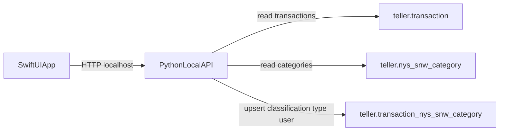

# SwiftUI Reclassification Plan

## Outcome
Deliver a polished, keyboard-friendly macOS app that lets users review Teller transactions, assign or change `nys_snw_category`, and persist each change to `teller.transaction_nys_snw_category` as a user classification.

## Architecture

## Implementation Steps
- Create a local API module in Python that reuses DB session setup from [`./teller/teller_db.py`](./teller/teller_db.py).
- Add endpoints for:
  - list transactions with current classification (left join mapping table + category labels)
  - list category hierarchy/options from [`./sql/postgres/teller_nys_snw_category.sql`](./sql/postgres/teller_nys_snw_category.sql)
  - upsert transaction classification into [`./sql/postgres/teller_transaction_nys_snw_category.sql`](./sql/postgres/teller_transaction_nys_snw_category.sql) with `type='user'` and conflict handling on `transaction_id`
- Add DB safety behavior in API:
  - validate `transaction_id` exists in [`./sql/postgres/teller_transaction.sql`](./sql/postgres/teller_transaction.sql)
  - validate `nys_snw_category_id` exists
  - update `updated_at` on reclassification
- Scaffold a new SwiftUI macOS app target in-repo (new `macos/` folder), with:
  - split view layout: transaction list (left) + detail/classification panel (right)
  - fast search/filter by description/date/amount/status
  - category picker with hierarchical labels (`level_1 > level_2 > level_3 > categorization`)
  - keyboard-first interactions (arrow navigation, Enter to save, Cmd+F search)
- Build UX polish layer:
  - optimistic UI updates with rollback on API failure
  - clear save states (idle/saving/saved/error)
  - inline validation and retry controls
  - empty/loading/error states with native macOS visuals
- Add bulk productivity actions:
  - next-unclassified shortcut
  - apply selected category to multi-select transactions
  - undo last local classification action (session-scoped)
- Add verification:
  - Python API tests for read/upsert paths
  - Swift unit tests for view model state transitions
  - lightweight end-to-end script proving reclassification persists and is reloaded correctly

## Key Files To Add/Change
- Reuse DB config from [`./teller/teller_db.py`](./teller/teller_db.py)
- New API package under [`./teller/`](./teller/)
- Optional API entry script near [`./07_teller_client.py`](./07_teller_client.py)
- New macOS app project under [`./macos/`](./macos/)

## Delivery Sequence
- Phase 1: API + DB upsert correctness
- Phase 2: SwiftUI shell + list/detail + single-save
- Phase 3: polish (keyboard, state handling, bulk actions)
- Phase 4: test hardening and packaging/run instructions