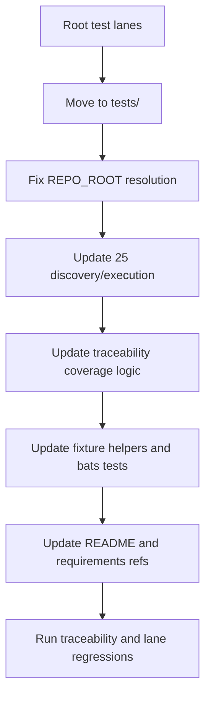

# Move 25 Child Lanes Into tests/

## Goal
Relocate the 16 lane scripts currently run by [`/Users/phil/local/src/teller/25_run_all_tests_parallel.sh`](/Users/phil/local/src/teller/25_run_all_tests_parallel.sh) into [`/Users/phil/local/src/teller/tests/`](/Users/phil/local/src/teller/tests/) using a **hard move** (no root wrappers), while keeping `25_run_all_tests_parallel.sh` in place and fully functional.
All file relocations in this plan must be executed with `git mv` (not copy/delete or plain `mv`) so rename history is preserved.

## Scope Of Moved Lanes
Move these root scripts into `tests/`:
- `00_run_requirements_traceability_tests.sh`
- `05_run_dependency_freshness_tests.sh`
- `06_run_av_test.sh`
- `07_run_static_security_tests.sh`
- `09_deploy_database_verification_test.sh`
- `10_run_shell_unit_tests.sh`
- `11_run_python_unit_tests.sh`
- `12_run_mutation_tests.sh`
- `13_run_sql_unit_tests.sh`
- `14_run_fuzz_tests.sh`
- `15_run_swift_unit_tests.sh`
- `16_run_macos_ui_regression_tests.sh`
- `17_verify_macos_crash_test.sh`
- `18_run_teller_api_smoke_tests.sh`
- `22_classification_persistence_verification_test.sh`
- `23_run_dynamic_security_tests.sh`

## Implementation Plan
1. **Physically move lane files into `tests/` and normalize repo-root resolution**
   - Move each lane file from repo root to [`/Users/phil/local/src/teller/tests/`](/Users/phil/local/src/teller/tests/) using `git mv`.
   - Update each moved script’s root resolution so execution still runs from repository root when invoked from `tests/` (most currently do `cd "$SCRIPT_DIR"` and assume root).
   - Standardize to a `SCRIPT_PATH` + `SCRIPT_DIR` + `REPO_ROOT` pattern where `REPO_ROOT` resolves to parent of `tests/`.

2. **Update `25` child discovery/execution to target `tests/` lanes**
   - Modify discovery in [`/Users/phil/local/src/teller/25_run_all_tests_parallel.sh`](/Users/phil/local/src/teller/25_run_all_tests_parallel.sh) from root `./*.sh` to `./tests/*.sh` while still excluding `25` itself.
   - Preserve existing logging/artifact behavior under `artifacts/parallel` and telemetry outputs.
   - Ensure special-case env injection logic still matches moved lane basenames (`22_...`, `23_...`, etc.).

3. **Align requirements traceability automation with new lane locations**
   - Update numbered script discovery/coverage checks in [`/Users/phil/local/src/teller/00_run_requirements_traceability_tests.sh`](/Users/phil/local/src/teller/00_run_requirements_traceability_tests.sh), especially logic that currently scans `[0-9][0-9]_*.sh` only at repo root.
   - Ensure requirements-to-source mapping and expected test coverage checks continue to work when numbered sources are in `tests/`.

4. **Fix shell test fixtures and lane-specific tests for moved script paths**
   - Update [`/Users/phil/local/src/teller/tests/sh/helpers/common.bash`](/Users/phil/local/src/teller/tests/sh/helpers/common.bash) `copy_script_to_fixture` behavior so it can copy moved lane scripts from `tests/`.
   - Update lane bats files (notably [`/Users/phil/local/src/teller/tests/sh/25_run_all_tests_parallel.bats`](/Users/phil/local/src/teller/tests/sh/25_run_all_tests_parallel.bats)) where hardcoded script names/locations assume root.
   - Keep assertions centered on behavior (discovery counts, pass/fail reporting, lock handling), not old file location assumptions.

5. **Refresh docs and requirements references that invoke moved lanes**
   - Update command references in [`/Users/phil/local/src/teller/README.md`](/Users/phil/local/src/teller/README.md) from `./NN_...` to `./tests/NN_...` for moved lanes.
   - Update requirements scope lines in affected docs under [`/Users/phil/local/src/teller/requirements/`](/Users/phil/local/src/teller/requirements/) so source references point to `tests/NN_...`.
   - Keep `25_run_all_tests_parallel.sh` references at repo root.

6. **Verification pass**
   - Run focused regression checks:
     - `bash tests/00_run_requirements_traceability_tests.sh`
     - `bats tests/sh/25_run_all_tests_parallel.bats`
     - `bash 25_run_all_tests_parallel.sh` (stub/real env as available)
   - Resolve any traceability or path regressions revealed by full coverage checks.

## Execution Flow

## Key Risk To Manage
Path-assumption breakage is the main risk: many moved lanes currently treat their own directory as repo root. The migration should prioritize root-resolution fixes first so subsequent test/discovery updates are deterministic.