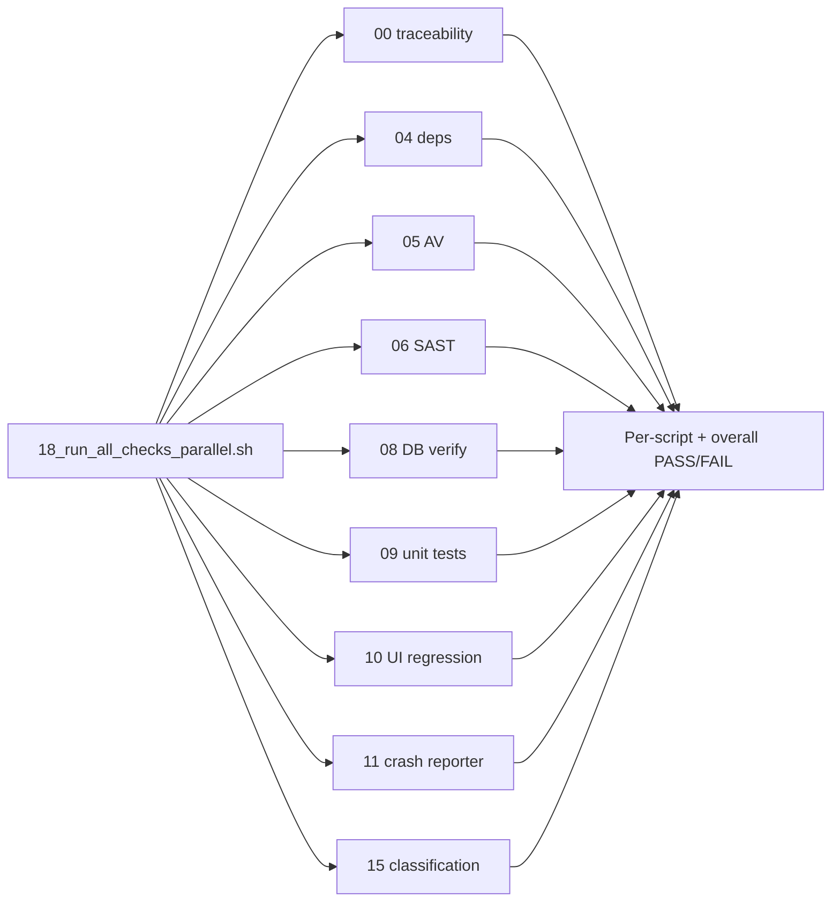

# Parallel checks orchestrator trio (18)

## Goal

Introduce `[18_run_all_checks_parallel.sh](18_run_all_checks_parallel.sh)` as a single entrypoint that launches these nine scripts **concurrently** from repo root:


| #   | Script                                    |
| --- | ----------------------------------------- |
| 00  | `00_run_requirements_traceability_tests.sh`  |
| 04  | `04_run_dependency_freshness_tests.sh`   |
| 05  | `05_run_av_test.sh`                     |
| 06  | `06_run_static_security_tests.sh`                          |
| 08  | `08_deploy_database_verification_test.sh`            |
| 09  | `09_run_shell_unit_tests.sh`                    |
| 10  | `15_run_macos_ui_regression_tests.sh`     |
| 11  | `16_verify_macos_crash_test.sh`       |
| 15  | `15_verify_classification_persistence.sh` |


Output contract (matches existing scripts like `[08_deploy_database_verification_test.sh](08_deploy_database_verification_test.sh)` and `[15_verify_classification_persistence.sh](15_verify_classification_persistence.sh)`):

- **9 lines**: one `✅ PASS:` or `❌ FAIL:` per child script
- **1 line**: overall `✅ PASS:` (all green) or `❌ FAIL:` (any red)
- Exit `0` only when all nine succeed




## 1. Requirements doc

Create `[requirements/18_run_all_checks_parallel-requirements.md](requirements/18_run_all_checks_parallel-requirements.md)` following the same structure as `[requirements/15_verify_classification_persistence-requirements.md](requirements/15_verify_classification_persistence-requirements.md)`:

**Scope:** `Applies to 18_run_all_checks_parallel.sh.`


| ID   | Statement                   | Design sketch                                                                                                                           | Tests                                                                                   |
| ---- | --------------------------- | --------------------------------------------------------------------------------------------------------------------------------------- | --------------------------------------------------------------------------------------- |
| R001 | Strict shell mode           | `set -euo pipefail`                                                                                                                     | R001-T01: force inner failure → non-zero exit                                           |
| R005 | Repo-root execution         | resolve `${BASH_SOURCE[0]}`, `cd` there                                                                                                 | R005-T01: invoke from another cwd, stubs still found                                    |
| R010 | Fixed nine-script checklist | hard-coded ordered list above; fail fast if any script file missing before launch                                                       | R010-T01: missing child script → clear error, no background jobs                        |
| R015 | Concurrent launch           | start all nine as background jobs before waiting                                                                                        | R015-T01: slow stubs (~1s each); wall time well below 9× sleep (proves parallelism)     |
| R020 | Independent exit capture    | disable errexit while waiting; record each child exit code separately                                                                   | R020-T01: one stub exits 1, others 0 → runner still waits for all nine and reports each |
| R025 | Per-script summary          | print exactly nine `✅ PASS:` / `❌ FAIL:` lines keyed by script basename                                                                 | R025-T01: all pass → nine PASS lines; R025-T02: mixed → correct FAIL lines              |
| R030 | Overall gate                | exit 0 + single overall PASS when all succeed; exit 1 + overall FAIL otherwise                                                          | R030-T01/T02: matching overall line + exit code                                         |
| R035 | Per-check log artifacts     | write stdout/stderr to `${PARALLEL_CHECKS_REPORT_DIR:-./.parallel-checks-reports}/<stem>.log`; on FAIL include log path in summary line | R035-T01: stub output appears in log file; FAIL line mentions path                      |
| R040 | Standalone meta-runner      | must not be invoked by any of the nine child scripts (child scripts stay independent entrypoints)                                       | R040-T01: grep the nine child scripts for `run_all_checks_parallel` → no matches        |


Changelog entry dated 2026-05-20.

## 2. Orchestrator script

Create `[18_run_all_checks_parallel.sh](18_run_all_checks_parallel.sh)`:

**Shell conventions** (match neighbors):

- `#!/usr/bin/env bash`, `umask 007`, `set -euo pipefail`
- `#Rxxx:` scoped tags on each requirement block (required by `[00_run_requirements_traceability_tests.sh](00_run_requirements_traceability_tests.sh)`)

**Core algorithm:**

```bash
CHECKS=( ... nine basenames ... )
REPORT_DIR="${PARALLEL_CHECKS_REPORT_DIR:-./.parallel-checks-reports}"
mkdir -p "$REPORT_DIR"

# R010: verify "./$script" exists for each
pids=()
for script in "${CHECKS[@]}"; do
  log="${REPORT_DIR}/${script%.sh}.log"
  (
    "./${script}" >"$log" 2>&1
    echo $? > "${log}.exit"
  ) &
  pids+=($!)
done

set +e
for pid in "${pids[@]}"; do wait "$pid"; done
set -e

# R025/R030/R035: read *.exit files, emit summaries, exit accordingly
```

**Output format** (stable for tests):

- `✅ PASS: 00_run_requirements_traceability_tests.sh`
- `❌ FAIL: 09_run_shell_unit_tests.sh (exit 1) — see ./.parallel-checks-reports/09_run_unit_tests.log`
- `✅ PASS: all parallel checks succeeded (9/9)`
- `❌ FAIL: parallel checks: 8/9 passed`

Print a short “starting parallel checks…” banner before launch; suppress interleaved child stdout (logs only in files) to keep the summary readable.

**Side fix:** Update stale comment in `[09_run_shell_unit_tests.sh](09_run_shell_unit_tests.sh)` line 14 (`#R030: ... dedicated script 18`) → reference `16_verify_macos_crash_test.sh` instead.

## 3. Bats tests

Create `[tests/sh/18_run_all_checks_parallel.bats](tests/sh/18_run_all_checks_parallel.bats)`:

**Harness** (reuse `[tests/sh/helpers/common.bash](tests/sh/helpers/common.bash)`):

- `setup_shell_test` / `create_repo_fixture` / `copy_script_to_fixture "18_run_all_checks_parallel.sh"`
- Helper `write_child_stub(name, body)` that copies minimal executable stubs for all nine children into `FIXTURE_ROOT`
- Default stubs: echo script name to stdout, exit 0

**Test cases** (with traceability header comments + inline `#Rxxx` tags, same pattern as `[tests/sh/16_verify_macos_crash_test.bats](tests/sh/16_verify_macos_crash_test.bats)`):

1. **all pass** — nine stubs exit 0 → status 0, nine `✅ PASS:` lines, overall PASS
2. **single failure** — `09_run_shell_unit_tests.sh` stub exits 1 → status 1, that script FAIL, others PASS, overall FAIL
3. **missing child** — omit one stub file → status non-zero before/at launch, actionable message naming missing script
4. **repo root** — run from `$TEST_TMPDIR`, child stubs log cwd → all invocations use fixture root
5. **parallelism** — each stub `sleep 1`; assert elapsed < 5s (sequential would be ~9s)
6. **log artifacts** — stub writes unique marker; verify marker in `${REPORT_DIR}/<stem>.log`
7. **standalone** — grep the nine real repo scripts (copied into fixture) for `run_all_checks_parallel`; expect no hits

Do **not** invoke real check scripts in unit tests (they are integration-heavy); stubs only.

## 4. Traceability / docs touch-ups

After the trio lands, `[00_run_requirements_traceability_tests.sh](00_run_requirements_traceability_tests.sh)` will automatically enforce:

- `requirements/18_*-requirements.md` exists for `18_*.sh`
- Scope references `18_run_all_checks_parallel.sh`
- `tests/sh/18_run_all_checks_parallel.bats` exists

Optional follow-ups (out of scope unless you want them in the same PR):

- Update `[README.md](README.md)` numbered-script list (currently references non-existent `18_configure_teller_io.sh`)
- Add row to `[tests/sh/README.md](tests/sh/README.md)`

## 5. Verification

```bash
# Unit tests for the new script only
bats tests/sh/18_run_all_checks_parallel.bats

# Traceability gate (will include 18 once trio exists)
./00_run_requirements_traceability_tests.sh requirements/18_run_all_checks_parallel-requirements.md 18_run_all_checks_parallel.sh

# Full local run (real integrations — long, needs env)
./18_run_all_checks_parallel.sh
```

## Notes

- Script **18** is confirmed despite stale README `18_configure_teller_io.sh` references; README cleanup is deferred.
- Running `00` inside the parallel batch creates a bootstrap dependency: the trio must exist before `./18_run_all_checks_parallel.sh` can pass its own `00` child — expected and self-enforcing.

