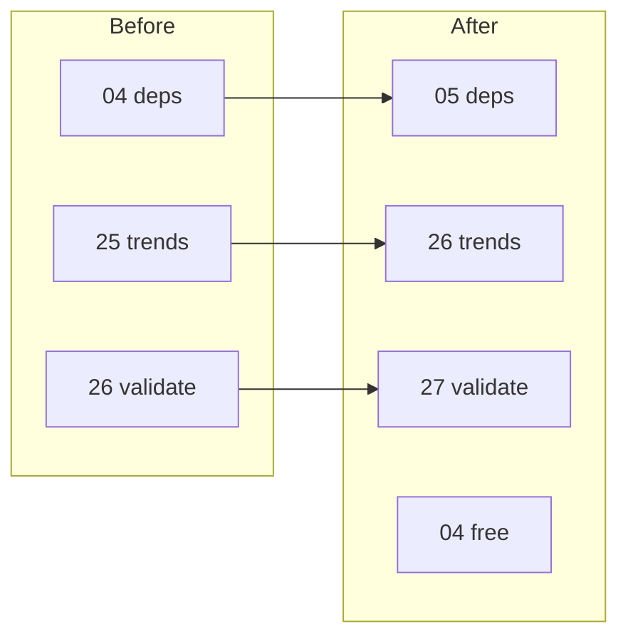

# Renumber workflow groups 04–26 → 05–27

## Context

The repo uses numbered **trios** (mostly) per workflow step:

| Layer | Pattern | Example |
|-------|---------|---------|
| Entrypoint | `{NN}_*.sh` or `{NN}_*.py` at repo root | [`04_run_dependency_freshness_tests.sh`](04_run_dependency_freshness_tests.sh) |
| Requirements | [`requirements/{NN}_*-requirements.md`](requirements/04_run_dependency_freshness_tests-requirements.md) | `Applies to \`04_...\`` in Scope |
| Shell tests | [`tests/sh/{NN}_*.bats`](tests/sh/04_run_dependency_freshness_tests.bats) | Header comments + `copy_script_to_fixture` |

**Exceptions (not full trios today):**

- **18/19** also have Python unit companions: [`tests/py/test_18_fetch_teller_api_data.py`](tests/py/test_18_fetch_teller_api_data.py), [`tests/py/test_19_backfill_bank_statements.py`](tests/py/test_19_backfill_bank_statements.py)
- **25/26** are **duos** only (script + bats; no requirements doc yet). After rename they become **26/27** with the same gap.

Scripts **00–03** and **97–99** are unchanged. Slot **04** becomes free.



## Phase 1: `git mv` all tracked artifacts (descending order)

**Critical:** Rename **high → low** (26→27 down to 04→05) so no destination path collides.

For each `N` from 26 down to 4, move every member of the group by replacing the `{NN}_` prefix with `{N+1}_` (suffix unchanged):

```bash
# Example for N=26 (repeat pattern for 25..4)
git mv 26_validate_quality_target.sh 27_validate_quality_target.sh
git mv tests/sh/26_validate_quality_target.bats tests/sh/27_validate_quality_target.bats
```

### Full inventory (69 `git mv` operations)

**Root entrypoints (23):** `04`…`26` → `05`…`27`

**Requirements (21):** `requirements/04`…`24` → `requirements/05`…`25` (no docs for current 25/26)

**Bats (23):** `tests/sh/04`…`26` → `tests/sh/05`…`27`

**Python test modules (2):**
- `tests/py/test_18_fetch_teller_api_data.py` → `tests/py/test_19_fetch_teller_api_data.py`
- `tests/py/test_19_backfill_bank_statements.py` → `tests/py/test_20_backfill_bank_statements.py`

**Out of scope for `git mv`:**
- [`mutants/tests/sh/`](mutants/tests/sh/) numbered bats (not tracked; optional manual rename for local mutation runs)
- Generated artifacts under [`artifacts/parallel/`](artifacts/parallel/) (stale log names; regenerated on next run)
- [`.cursor/plans/`](.cursor/plans/) (historical plans; not user-facing docs)

## Phase 2: Update in-file references

After renames, sweep **content** (not another rename) for stale `04`–`26` script names. Prefer targeted search:

```bash
rg -n '`(0[4-9]|1[0-9]|2[0-6])_' --glob '*.{sh,bats,py,md}' \
  --glob '!requirements/**/changelog*' --glob '!.cursor/**'
```

Avoid changing **dates** in changelog lines (e.g. `2026-04-19`).

### High-impact files (cross-script references)

| File | What to update |
|------|----------------|
| [`README.md`](README.md) | Script execution order, Quick Start block, testing profiles (~48 backtick refs) |
| [`tests/sh/README.md`](tests/sh/README.md) | Tier notes (`05`,`06`,`08`,`17`,`23` → +1) |
| [`src/macos-ui/README.md`](src/macos-ui/README.md) | Run commands and requirements path refs |
| [`docs/teller-connect-ui/teller-connect.md`](docs/teller-connect-ui/teller-connect.md) | `./23_run_classification_macos-ui.sh` → `./24_...` |
| [`25_run_all_tests_parallel.sh`](24_run_all_tests_parallel.sh) (→ `25_`) | Lock file `.24_run_all_tests_parallel.lock` → `.25_...`; error strings mentioning script name |
| [`tests/sh/25_run_all_tests_parallel.bats`](tests/sh/24_run_all_tests_parallel.bats) (→ `25_`) | `CHECKS` stub array (all child script names +1); lock-file paths; `copy_script_to_fixture` / run invocations |
| [`12_run_mutation_tests.sh`](11_run_mutation_tests.sh) (→ `12_`) | Preflight hint `./10_run_python_unit_tests.sh` → `./11_...` |
| [`07_run_static_security_tests.sh`](06_run_static_security_tests.sh) (→ `07_`) | `./20_run_classification_api.py` → `./21_...`; bandit `-r` paths for ingest scripts |
| [`23_run_dynamic_security_tests.sh`](22_run_dynamic_security_tests.sh) (→ `23_`) | `./20_run_classification_api.py` → `./21_...` |
| [`22_classification_persistence_verification_test.sh`](21_classification_persistence_verification_test.sh) (→ `22_`) | API launch path |
| [`19_fetch_teller_api_data.py`](18_fetch_teller_api_data.py) (→ `19_`) | `./23_run_classification_macos-ui.sh` → `./24_...` |
| [`26_report_quality_trends.sh`](25_report_quality_trends.sh) (→ `26_`) | `./24_run_all_tests_parallel.sh` → `./25_...` |
| [`27_validate_quality_target.sh`](26_validate_quality_target.sh) (→ `27_`) | same |
| [`01_install_prerequisites.sh`](01_install_prerequisites.sh) | `./16_verify_macos_crash_test.sh` → `./17_...` |
| [`src/scripts/run_unit_test_lanes.sh`](src/scripts/run_unit_test_lanes.sh) | `./15_run_macos_ui_regression_tests.sh` → `./16_...` |
| [`src/scripts/check_teller_api_drift.py`](src/scripts/check_teller_api_drift.py) | `Path("23_...")`, `Path("18_...")` |
| [`src/scripts/dast_baseline.py`](src/scripts/dast_baseline.py), [`src/scripts/dast_cleanup.py`](src/scripts/dast_cleanup.py) | Any hardcoded numbered paths |
| [`00_run_requirements_traceability_tests.sh`](00_run_requirements_traceability_tests.sh) | Hardcoded `15_run_macos_ui_regression_tests-requirements.md` basename check → `16_...` |

### Per-group self-references (every renamed trio/duo)

For **each** moved group, update inside the renamed files:

1. **Requirements doc:** `Applies to`, Design sections, changelog script names, test-case command examples
2. **Bats file:** header `requirements/{NN}_...` path; `copy_script_to_fixture "{NN}_..."`; `./{NN}_...` invocations; Python module paths like `tests.py.test_18_...` → `tests.py.test_19_...`
3. **Root script/py:** user-facing echo/help strings referencing other numbered scripts

### Requirements cross-refs (examples)

Several docs reference sibling scripts by number and need +1:

- [`requirements/15_run_macos_ui_regression_tests-requirements.md`](requirements/15_run_macos_ui_regression_tests-requirements.md) → becomes `16_...`; refs to `16_verify_macos_crash_test` → `17_...`
- [`requirements/16_verify_macos_crash_test-requirements.md`](requirements/16_verify_macos_crash_test-requirements.md) → refs to `09_`, `15_` runners
- [`requirements/06_run_static_security_tests-requirements.md`](requirements/06_run_static_security_tests-requirements.md) / [`22_...`](requirements/22_run_dynamic_security_tests-requirements.md) split note
- [`requirements/08_deploy_database_verification_test-requirements.md`](requirements/08_deploy_database_verification_test-requirements.md) → `07_deploy_database` → `08_deploy_database`
- [`requirements/24_run_all_tests_parallel-requirements.md`](requirements/24_run_all_tests_parallel-requirements.md) → self-references

### Python test modules

After `git mv`:

- [`tests/py/test_19_fetch_teller_api_data.py`](tests/py/test_18_fetch_teller_api_data.py): `repo_root / "19_fetch_teller_api_data.py"` (was `18_...`)
- [`tests/py/test_20_backfill_bank_statements.py`](tests/py/test_19_backfill_bank_statements.py): `19_backfill...` → `20_backfill...`
- [`tests/sh/19_fetch_teller_api_data.bats`](tests/sh/18_fetch_teller_api_data.bats): unittest discovery paths `tests.py.test_19_...`
- [`tests/sh/20_backfill_bank_statements.bats`](tests/sh/19_backfill_bank_statements.bats): `tests.py.test_20_...`

## Phase 3: Verification

1. **Stale-name grep** — no remaining backtick/`./` references to old `04`–`26` script basenames (excluding dates and `.cursor/plans`)
2. **Traceability** — `./00_run_requirements_traceability_tests.sh` (numbered coverage + scope alignment)
3. **Targeted bats** — at minimum:
   - `./10_run_shell_unit_tests.sh` (was `09_`; discovers bats by glob, so renames are picked up automatically)
   - Focused runs on parallel orchestrator and a couple of cross-referencing scripts (mutation, static security, fetch)
4. **Optional:** remove stale repo-root lock file `.24_run_all_tests_parallel.lock` if present locally

## Mapping reference (old → new)

| Old | New |
|-----|-----|
| 04_run_dependency_freshness_tests | 05_run_dependency_freshness_tests |
| 05_run_av_test | 06_run_av_test |
| 06_run_static_security_tests | 07_run_static_security_tests |
| 07_deploy_database | 08_deploy_database |
| 08_deploy_database_verification_test | 09_deploy_database_verification_test |
| 09_run_shell_unit_tests | 10_run_shell_unit_tests |
| 10_run_python_unit_tests | 11_run_python_unit_tests |
| 11_run_mutation_tests | 12_run_mutation_tests |
| 12_run_sql_unit_tests | 13_run_sql_unit_tests |
| 13_run_fuzz_tests | 14_run_fuzz_tests |
| 14_run_swift_unit_tests | 15_run_swift_unit_tests |
| 15_run_macos_ui_regression_tests | 16_run_macos_ui_regression_tests |
| 16_verify_macos_crash_test | 17_verify_macos_crash_test |
| 17_run_teller_api_smoke_tests | 18_run_teller_api_smoke_tests |
| 18_fetch_teller_api_data | 19_fetch_teller_api_data |
| 19_backfill_bank_statements | 20_backfill_bank_statements |
| 20_run_classification_api | 21_run_classification_api |
| 21_classification_persistence_verification_test | 22_classification_persistence_verification_test |
| 22_run_dynamic_security_tests | 23_run_dynamic_security_tests |
| 23_run_classification_macos-ui | 24_run_classification_macos-ui |
| 24_run_all_tests_parallel | 25_run_all_tests_parallel |
| 25_report_quality_trends | 26_report_quality_trends |
| 26_validate_quality_target | 27_validate_quality_target |
