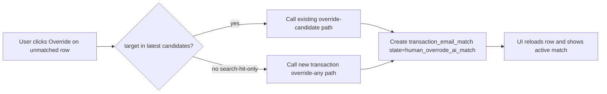

# Restore critical unmatched override flow

## Goal
Allow users to link an unmatched transaction to an email selected from Search Email (not just latest-run candidates) via `Override`, while preserving strict candidate-only behavior for `Confirm`.

## Current failure path (validated)
- The backend rejects unmatched transaction mutations unless `email_message_id` exists in latest candidate run via `_ensure_candidate_for_transaction(...)` in [src/teller/classification/services.py](/Users/phil/local/src/teller/src/teller/classification/services.py).
- The macOS view model additionally blocks both unmatched `Confirm` and unmatched `Override` when target is search-hit-only (`isOverrideTargetSearchHitOnly`) in [src/macos-ui/Sources/TransactionClassifier/ClassificationViewModel.swift](/Users/phil/local/src/teller/src/macos-ui/Sources/TransactionClassifier/ClassificationViewModel.swift) and [src/macos-ui/Sources/TransactionClassifier/ClassificationViewModel+MatchReview.swift](/Users/phil/local/src/teller/src/macos-ui/Sources/TransactionClassifier/ClassificationViewModel+MatchReview.swift).
- This produces the exact 409 seen in UI: `email_message_id is not a candidate for the latest match run of this transaction`.

## Implementation approach

### 1) Introduce explicit transaction-level override-any backend mutation
- Add a new route in [src/teller/classification/app.py](/Users/phil/local/src/teller/src/teller/classification/app.py), e.g. `PUT /v1/matchy/transactions/{transaction_id}/override`.
- Reuse existing body schema (`MatchOverrideMutation`) and write semantics (`human_overrode_ai_match`, audit note).
- Implement via a new services helper that:
  - validates posted transaction exists and no active match exists,
  - validates `email_message_id` format,
  - **does not require latest-run candidate membership**,
  - creates active match + audit row with same conflict behavior.
- Keep `/override-candidate` unchanged (candidate-enforced) so contract remains explicit and backwards-compatible.

### 2) Keep Confirm strict and reroute unmatched Override in macOS UI
- In [src/macos-ui/Sources/TransactionClassifier/APIClient.swift](/Users/phil/local/src/teller/src/macos-ui/Sources/TransactionClassifier/APIClient.swift), add `overrideTransaction(...)` client method for new backend endpoint.
- In [src/macos-ui/Sources/TransactionClassifier/ClassificationViewModel.swift](/Users/phil/local/src/teller/src/macos-ui/Sources/TransactionClassifier/ClassificationViewModel.swift):
  - keep `canConfirmSelectedMatch` candidate-scoped for unmatched rows,
  - allow `canOverrideSelectedMatch` for unmatched rows whenever a target email id exists.
- In [src/macos-ui/Sources/TransactionClassifier/ClassificationViewModel+MatchReview.swift](/Users/phil/local/src/teller/src/macos-ui/Sources/TransactionClassifier/ClassificationViewModel+MatchReview.swift):
  - keep `confirmSelectedMatch()` behavior as-is for search-hit-only (error + no API call),
  - update `overrideSelectedMatch()` unmatched branch:
    - candidate target -> existing `overrideTransactionCandidate(...)`,
    - search-hit-only target -> new `overrideTransaction(...)`.
- Preserve stale-snapshot fallback (R100) and existing active-match override path (`overrideMatch(matchId:...)`).

### 3) Update requirements to reflect intended contract
- Update ViewModel requirements in [requirements/macos-ui/ClassificationViewModel-requirements.md](/Users/phil/local/src/teller/requirements/macos-ui/ClassificationViewModel-requirements.md):
  - replace current R110 wording so only unmatched `Confirm` is blocked for search-hit-only;
  - unmatched `Override` is explicitly allowed for valid ids.
- Update API requirements in [requirements/macos-ui/APIClient-requirements.md](/Users/phil/local/src/teller/requirements/macos-ui/APIClient-requirements.md) and [requirements/teller/teller_classification_api-requirements.md](/Users/phil/local/src/teller/requirements/teller/teller_classification_api-requirements.md):
  - document new override-any endpoint and error semantics.
- If needed, update UI wording in [requirements/macos-ui/MatchAndClassifyViews-requirements.md](/Users/phil/local/src/teller/requirements/macos-ui/MatchAndClassifyViews-requirements.md) to clarify action intent.

### 4) Expand test coverage for critical path
- macOS tests in [src/macos-ui/Tests/TransactionClassifierTests/ClassificationViewModelTests.swift](/Users/phil/local/src/teller/src/macos-ui/Tests/TransactionClassifierTests/ClassificationViewModelTests.swift):
  - add/adjust tests asserting unmatched search-hit-only `Confirm` remains blocked,
  - add tests asserting unmatched search-hit-only `Override` calls new API method and succeeds.
- Client tests in [src/macos-ui/Tests/TransactionClassifierTests/APIClientTests.swift](/Users/phil/local/src/teller/src/macos-ui/Tests/TransactionClassifierTests/APIClientTests.swift):
  - verify new endpoint path serialization.
- Backend tests in [tests/py/test_teller_classification_api.py](/Users/phil/local/src/teller/tests/py/test_teller_classification_api.py):
  - allow override-any for valid searched email IDs not in latest candidate run,
  - retain candidate enforcement for `/confirm-candidate` and `/override-candidate`.
- Contract scenario tests in [src/macos-ui/Tests/TransactionClassifierTests/FrontendBackendContractScenarioTests.swift](/Users/phil/local/src/teller/src/macos-ui/Tests/TransactionClassifierTests/FrontendBackendContractScenarioTests.swift) and [tests/contracts/frontend_backend_contract_scenarios.json](/Users/phil/local/src/teller/tests/contracts/frontend_backend_contract_scenarios.json):
  - add scenario rows for unmatched override-any request shape/route.

### 5) Validation plan
- Run focused Swift tests for match-review behavior and API path serialization.
- Run focused Python tests for new route + candidate guard invariants.
- Manual UI validation: reproduce screenshot flow and verify `Override with this email` succeeds for search-hit-only email, transaction row updates to matched state, and `Confirm` still refuses non-candidate IDs for unmatched rows.