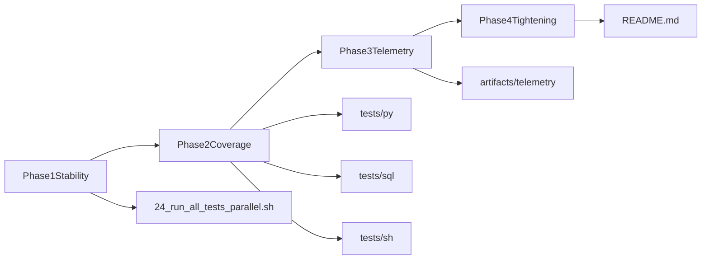

# Local Roadmap to 9.5+ Testing Quality

## Goal and Constraints

- Reach an objective local testing score of 9.5+ with no new CI workflow overhead.
- Keep current disciplined numbered-lane model, but reduce false negatives and increase signal quality.
- Optimize for a month-plus rollout with phased hardening.
- Preserve current `24_run_all_tests_parallel.sh` wall time as a hard constraint (target approximately 2 minutes, avoid broad serialization).

## Performance SLO for `24`

- Baseline definition:
  - Capture the first 20 local runs after rollout as baseline samples.
  - Track `wall_elapsed` from `24` output and persist to local telemetry history.
- Hard SLO (steady state):
  - p95 `24` wall time <= 150 seconds over rolling 20 runs.
  - p50 `24` wall time <= 130 seconds over rolling 20 runs.
  - No single run > 180 seconds unless explicitly marked as investigation run.
- Acceptance gates for plan work:
  - Any change that improves reliability but violates p95 SLO is rejected until performance is recovered.
  - Preferred remediation order: resource isolation, startup ownership, and targeted tuning before any lane serialization.
- Alert policy (local-only):
  - Warn when rolling p95 exceeds 150 seconds for 3 consecutive runs.
  - Fail the performance acceptance check when rolling p95 exceeds 160 seconds.

## Target Score Model (Local)

- Define a repo-local score computed after full runs:
  - 35% lane pass reliability (stable green across repeated runs)
  - 25% behavioral coverage depth (Python ingest/API + SQL + Swift/UI)
  - 20% effectiveness quality (mutation + fuzz budgets)
  - 20% security/runtime quality (SAST/DAST/AV + contract stability)
- Success criteria for 9.5+:
  - > = 95% pass reliability on full local runs over rolling 2 weeks
  - no unresolved high-severity gate failures
  - mutation/fuzz budgets consistently met
  - no known flaky lane left untriaged

## Phase 1: Stabilize Gate Reliability (Week 1-2)

- Fix fuzz/property path and missing test-target mismatches:
  - Align `[13_run_fuzz_tests.sh](13_run_fuzz_tests.sh)` and `[pyproject.toml](pyproject.toml)` with real test paths.
  - Add or retarget missing mutmut/pytest referenced modules under `[tests/py/](tests/py/)`.
- Remove parallel contention in `[24_run_all_tests_parallel.sh](24_run_all_tests_parallel.sh)` without slowing runtime:
  - Isolate API ownership: assign fixed lane-specific ports and avoid dual auto-start races between `21` and `22`.
  - Isolate DB mutation scope for DAST and persistence checks via lane-specific profile/schema strategy when run in parallel.
  - Keep Swift lanes concurrent at orchestrator level while relying on existing lock coordination and timeout tuning.
- Create explicit local run tiers in docs:
  - Fast pre-merge and full confidence profiles in `[README.md](README.md)` using existing lanes/env flags.

## Contention Strategy Without Runtime Penalty

- API contention mitigation:
  - Reserve deterministic ports by lane (example: `21` on `8787`, `22` on `8788`) and document ownership.
  - Prefer one-lane API startup authority, with the other lane configured to reuse instead of racing to bind.
- DB contention mitigation:
  - Route high-mutation DAST operations to an isolated lane target (separate profile/schema) when running under `24`.
  - Keep production-like profile checks in dedicated lanes, but avoid concurrent writes against the same rows during `24`.
- Swift contention mitigation:
  - Keep existing lock helper as the coordination mechanism; tune lock timeout only where needed.
  - Do not serialize all Swift lanes globally unless telemetry proves lock timeouts persist.
- Performance guardrail:
  - Add a runtime budget check for `24` that warns on regressions above agreed threshold rather than reducing concurrency by default.

## Phase 2: Increase Behavioral Coverage (Week 2-4)

- Replace grep-style shell assertions with behavior-driven tests for ingest/backfill paths:
  - Strengthen `[tests/sh/18_fetch_teller_api_data.bats](tests/sh/18_fetch_teller_api_data.bats)`, `[tests/sh/19_backfill_bank_statements.bats](tests/sh/19_backfill_bank_statements.bats)`.
  - Add focused Python behavior tests in `[tests/py/](tests/py/)` for ingest transforms and persistence edge cases.
- Expand SQL contract coverage beyond smoke checks:
  - Add pgTAP tests in `[tests/sql/](tests/sql/)` for trigger/FK/view invariants currently validated mostly by integration lanes.
- Close API contract gaps revealed by DAST:
  - Add explicit contract regression tests in `[tests/py/test_teller_classification_api.py](tests/py/test_teller_classification_api.py)` for matchy/mailcart status/response behavior.

## Phase 3: Normalize Local Telemetry and Trend Scoring (Week 3-5)

- Add a local telemetry layer (no CI dependency):
  - Emit normalized lane summaries from scripts and orchestrator logs under `artifacts/telemetry/`.
  - Start append-only history (`quality-history.ndjson`) and trend snapshots (`quality-trend.json`).
- Use mutation lane pattern as template:
  - Mirror the history/trend structure already in `[11_run_mutation_tests.sh](11_run_mutation_tests.sh)`.
- Add a quality report command:
  - New reporting entrypoint (e.g., `25_report_quality_trends.sh`) to print current score, deltas, and flake indicators.

## Phase 4: Tighten Local Gates and Developer Workflow (Week 5+)

- Raise strictness in local full-run profile only (not CI):
  - Make mutation preflight non-skippable by default unless explicitly overridden.
  - Enforce finalized fuzz budgets and minimum property-test counts.
- Standardize Python test execution path (prefer single runner semantics) to avoid split behavior between unittest/pytest lanes.
- Add short triage playbooks for recurring lane classes (DB contention, SwiftPM lock, API port contention) in `[README.md](README.md)`.

## Implementation Map

## Key Files to Touch

- Orchestration and lane behavior:
  - `[24_run_all_tests_parallel.sh](24_run_all_tests_parallel.sh)`
  - `[13_run_fuzz_tests.sh](13_run_fuzz_tests.sh)`
  - `[11_run_mutation_tests.sh](11_run_mutation_tests.sh)`
  - `[src/scripts/run_unit_test_lanes.sh](src/scripts/run_unit_test_lanes.sh)`
- Test suites:
  - `[tests/py/test_teller_classification_api.py](tests/py/test_teller_classification_api.py)`
  - `[tests/py/test_18_fetch_teller_api_data.py](tests/py/test_18_fetch_teller_api_data.py)`
  - `[tests/sh/24_run_all_tests_parallel.bats](tests/sh/24_run_all_tests_parallel.bats)`
  - `[tests/sql/01_schema_smoke.sql](tests/sql/01_schema_smoke.sql)`
- Config/docs:
  - `[pyproject.toml](pyproject.toml)`
  - `[README.md](README.md)`
  - `[requirements/](requirements/)`

## Milestone Exit Criteria

- M1 (stability): full-run false-failure rate reduced to near-zero for known contention classes while meeting `24` performance SLO (p95 <= 150s).
- M2 (coverage): ingest/backfill + SQL invariants + DAST-derived API contracts have dedicated behavioral tests.
- M3 (telemetry): local score and trend generated automatically after full runs.
- M4 (9.5+): rolling local score >= 9.5 for two weeks with no unresolved critical gate regressions.

