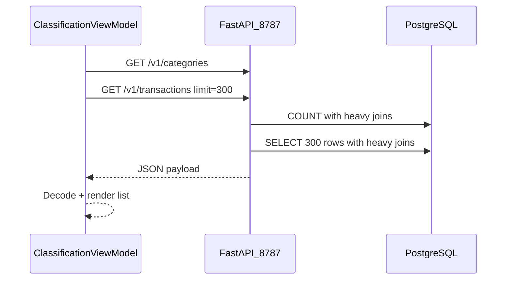

# UI transaction load slowness investigation

## Direct answer: is it TLS?

**Probably not as the primary cause.** Recent TLS work (commits `f98d5a9`, `61d4e2e`, today) changed defaults so both sides use loopback HTTPS:

- Server: [`20_run_classification_api.py`](20_run_classification_api.py) defaults to uvicorn with `ssl_certfile` / `ssl_keyfile` unless `TELLER_CLASSIFIER_ALLOW_INSECURE_HTTP=true`
- Client: [`APIClient.swift`](src/macos-ui/Sources/TransactionClassifier/APIClient.swift) defaults to `https://127.0.0.1:8787` with [`LocalClassifierTLS.swift`](src/macos-ui/Sources/TransactionClassifier/LocalClassifierTLS.swift) cert pinning

For `127.0.0.1`, TLS adds a one-time handshake on a reused connection (typically single-digit milliseconds). That does **not** match a long “Loading…” spinner unless something is **misconfigured**:

| TLS-related failure mode | Symptom |
|---|---|
| UI on `https://` but API still on plain `http://` (or reverse) | Failures/timeouts, not a slow success |
| Missing cert files (API won’t start) or pinning rejects cert | Hard errors in `errorText`, not slow load |
| `TELLER_CLASSIFIER_HTTP_PROXY` set (e.g. from DAST/UI tests) | Localhost traffic routed through a proxy → very slow |
| Cert PEM re-read on every TLS challenge | Minor; unlikely alone for multi-second spinner |

**More likely cause for your symptom (long initial spinner):** backend work on [`GET /v1/transactions`](src/teller/teller_classification_api.py), not transport.



---

## What changed in the loading path

### 1. UI initial load (your spinner)

[`ClassificationViewModel.loadAll()`](src/macos-ui/Sources/TransactionClassifier/ClassificationViewModel.swift):

- Fetches **categories** and **transactions** concurrently
- Uses `pageSize = 300` (not the API default 150)
- Default filter `onlyUnclassified = true` (still runs expensive joins before `WHERE` filters)

Triggered from [`ContentView`](src/macos-ui/Sources/TransactionClassifier/ContentView.swift) `.task { await viewModel.loadAll() }`.

### 2. Heavier SQL since Match & Classify merge (May 19, commit `28d56e9`)

**Before:** one `LATERAL` for latest category; no email-match joins.

**After ([`_TRANSACTION_LIST_SQL` / `_TRANSACTION_COUNT_SQL`](src/teller/teller_classification_api.py)):**

- Second `LATERAL` on `teller.transaction_email_match` (pick representative active row)
- **Per-row correlated subquery** for `match_count`:

```sql
(SELECT COUNT(*) FROM teller.transaction_email_match
  WHERE transaction_id = tt.transaction_id AND active = TRUE)::INT AS match_count
```

- Same join graph duplicated in **`COUNT(*)`** then **`SELECT ... LIMIT 300`** — two full heavy passes per UI load

Indexes exist on `transaction_id` ([`teller_transaction_email_match.sql`](src/sql/postgres/teller_transaction_email_match.sql)), but the planner may still scan many posted rows when `only_unclassified` filters after joins.

### 3. TLS timeline (May 25–26)

- Default URL flipped `http://` → `https://` in API client
- Pinning delegate added

This is **recent** and easy to blame, but your **initial-spinner** symptom aligns better with **DB time on COUNT+LIST** than with loopback crypto.

---

## Diagnosis plan (read-only, ~15 minutes)

Run these in order; stop when one step shows a clear dominant cost.

### Step A — TLS A/B on the same machine

With classifier API already running:

```bash
# HTTPS (current default)
time curl -sk -H "X-Teller-Write-Token: $(1psa -p TELLER_CLASSIFIER_WRITE_TOKEN)" \
  "https://127.0.0.1:8787/v1/transactions?only_unclassified=true&limit=300&offset=0" \
  -o /dev/null -w "total=%{time_total}\n"

# HTTP only if API was started with TELLER_CLASSIFIER_ALLOW_INSECURE_HTTP=true
time curl -s -H "X-Teller-Write-Token: $(1psa -p TELLER_CLASSIFIER_WRITE_TOKEN)" \
  "http://127.0.0.1:8787/v1/transactions?only_unclassified=true&limit=300&offset=0" \
  -o /dev/null -w "total=%{time_total}\n"
```

**Interpretation:**

- HTTPS only ~10–50ms slower than HTTP → **not TLS**
- HTTPS orders of magnitude slower / hangs → check scheme mismatch, proxy, cert trust
- Both slow (seconds+) → **DB/query** (Step B)

Also verify the app environment:

```bash
env | rg 'TELLER_CLASSIFIER_(API_URL|ALLOW_INSECURE_HTTP|HTTP_PROXY|TLS_)'
```

### Step B — Split COUNT vs LIST in Postgres

Using the same DB profile the API uses (`TELLER_DB_PROFILE` / [`config/db-profiles.json`](config/db-profiles.json)):

- `EXPLAIN (ANALYZE, BUFFERS)` on `_TRANSACTION_COUNT_SQL` and `_TRANSACTION_LIST_SQL` with `only_unclassified=true`, `limit=300`, empty search/match filters

**Interpretation:**

- COUNT dominates → optimize or defer total (see fixes)
- LIST dominates → focus on `match_count` subquery + lateral match join
- High latency only on **managed** profile → network/Supabase TLS to DB (separate from API TLS)

### Step C — Confirm UI waits on this one request

Temporarily log server-side duration around lines 1168–1170 in [`list_transactions`](src/teller/teller_classification_api.py) (count ms, list ms) or watch uvicorn access log while opening the app.

### Step D — Rule out stale HTTP default in docs

[`src/macos-ui/README.md`](src/macos-ui/README.md) still documents `http://127.0.0.1:8787`; code defaults to HTTPS. If the API was started before TLS bootstrap, the UI may be retrying/failing rather than “slow” — check `errorText` in the UI vs spinner-only.

---

## Remediation options (after diagnosis confirms bottleneck)

Prioritize by impact vs scope:

1. **SQL: remove per-row `match_count` correlated subquery**  
   Replace with a grouped subquery / window count joined once (e.g. `COUNT(*) OVER (PARTITION BY transaction_id)` on active matches, or pre-aggregated `active_match_count` in the lateral). Keeps R070 fields without N×subquery cost.

2. **API: defer or approximate `total`**  
   For first paint, return `items` only (or `total=-1`) and run COUNT asynchronously or only when the user needs pagination accuracy. Big win if COUNT scans the full posted set.

3. **UI: smaller first page**  
   Lower `pageSize` from 300 to 150 (API default) or 50 for first load; use `loadMore()` for the rest. Cheap change; doesn’t fix COUNT if UI still needs `total`.

4. **TLS hygiene (if Step A shows TLS issues)**  
   - Run [`04_bootstrap_local_classifier_tls.sh`](04_bootstrap_local_classifier_tls.sh)  
   - Align launcher + app scheme (`https` both sides, or explicit `TELLER_CLASSIFIER_ALLOW_INSECURE_HTTP=true` both sides)  
   - Unset `TELLER_CLASSIFIER_HTTP_PROXY` outside DAST  
   - Optional micro-optimization: cache loaded `SecCertificate` in `LocalClassifierTLSSessionDelegate` (read PEM once, not per challenge)

5. **Docs**  
   Update macOS README to match HTTPS default and troubleshooting bullets in root [`README.md`](README.md).

---

## Expected conclusion

| Hypothesis | Likelihood for long initial spinner |
|---|---|
| Loopback HTTPS crypto | Low |
| HTTP/HTTPS mismatch or proxy misconfig | Medium (if env wrong) |
| R070 `/v1/transactions` COUNT + LIST + `match_count` | **High** |
| Remote managed DB latency | Medium (if profile is managed) |
| SwiftUI rendering 300 rows | Low (you see spinner before rows) |

**Recommended next action:** Step A + Step B. If both HTTP and HTTPS curls are slow, implement SQL fix (1) and/or defer COUNT (2) rather than reverting TLS.
