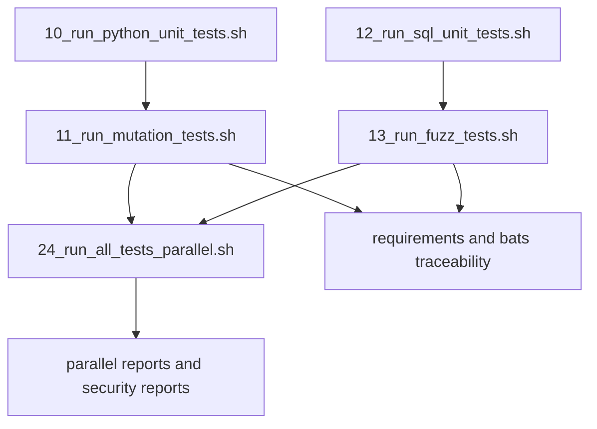

# Migrate Matchy 10/11 Into Teller

## Recommended sequence and swizzle strategy
Use **strict adjacent sequencing**: each imported lane is placed immediately after its corresponding unit lane, even though this requires renumbering downstream scripts.

Selected implementation target:
- `10_run_python_unit_tests.sh` (existing)
- `11_run_mutation_tests.sh` (new, from matchy `10_*`)
- `12_run_sql_unit_tests.sh` (renamed from current `11_*`)
- `13_run_fuzz_tests.sh` (new, from matchy `11_*`)
- `14_run_swift_unit_tests.sh` (renamed from current `12_*`)
- Shift existing `13..21` to `15..23`
- `24_run_all_tests_parallel.sh` (renamed from current `22_*`)

Why this is the best fit for your requirement:
- Enforces your “run right after respective unit tests” ordering directly in script numbering and docs.
- Keeps everything within the pre-orchestrator range (both new lanes `< 22` in the old scheme, and still pre-meta-runner after renumber).
- Maintains a single contiguous numbered workflow instead of hidden dependency tricks.

## Migration flow

## Concrete plan
1. Port source artifacts from `../matchy`
- Bring over:
  - [`/Users/phil/local/src/matchy/10_run_mutation_tests.sh`](/Users/phil/local/src/matchy/10_run_mutation_tests.sh)
  - [`/Users/phil/local/src/matchy/11_run_fuzz.sh`](/Users/phil/local/src/matchy/11_run_fuzz.sh)
  - [`/Users/phil/local/src/matchy/requirements/10_run_mutation_tests-requirements.md`](/Users/phil/local/src/matchy/requirements/10_run_mutation_tests-requirements.md)
  - [`/Users/phil/local/src/matchy/requirements/11_run_fuzz-requirements.md`](/Users/phil/local/src/matchy/requirements/11_run_fuzz-requirements.md)
  - [`/Users/phil/local/src/matchy/tests/sh/10_run_mutation_tests.bats`](/Users/phil/local/src/matchy/tests/sh/10_run_mutation_tests.bats)
  - [`/Users/phil/local/src/matchy/tests/sh/11_run_fuzz.bats`](/Users/phil/local/src/matchy/tests/sh/11_run_fuzz.bats)
- Re-home these in teller as 11/13 equivalents under root, `requirements/`, and `tests/sh/`.

2. Reswizzle runtime dependencies to teller conventions
- Adapt venv and path assumptions from `matchy-venv` to `teller-venv`.
- Port support utilities required by mutation lane:
  - [`/Users/phil/local/src/matchy/tools/mutmut_darwin.py`](/Users/phil/local/src/matchy/tools/mutmut_darwin.py)
  - [`/Users/phil/local/src/matchy/tools/mutmut_darwin_stub.py`](/Users/phil/local/src/matchy/tools/mutmut_darwin_stub.py)
  into [`/Users/phil/local/src/teller/tools/`](/Users/phil/local/src/teller/tools/).
- Add/merge `mutmut` configuration from [`/Users/phil/local/src/matchy/pyproject.toml`](/Users/phil/local/src/matchy/pyproject.toml) into [`/Users/phil/local/src/teller/pyproject.toml`](/Users/phil/local/src/teller/pyproject.toml), retargeting `only_mutate` paths to teller-owned modules.
- Add required Python dependencies (`mutmut`, `hypothesis`) in [`/Users/phil/local/src/teller/requirements.txt`](/Users/phil/local/src/teller/requirements.txt).

3. Perform strict renumber cascade for downstream teller scripts
- Rename numbered top-level scripts to preserve contiguous order after inserting 11 and 13:
  - current `11` → `12`
  - current `12` → `14`
  - current `13..21` → `15..23`
  - current `22` → `24`
- Rename companion shell tests in [`/Users/phil/local/src/teller/tests/sh/`](/Users/phil/local/src/teller/tests/sh/) to matching new numbers.
- Rename companion requirement docs in [`/Users/phil/local/src/teller/requirements/`](/Users/phil/local/src/teller/requirements/) to matching new numbers.
- Update any script-to-script invocations and README references that mention old numbers.

4. Port and retarget test intent (not just script text)
- Import/translate scoring-focused property/mutation tests from matchy into teller-owned test scope:
  - likely new property tests in [`/Users/phil/local/src/teller/tests/py/`](/Users/phil/local/src/teller/tests/py/)
- Replace matchy-specific module references (`matchy.scoring_core`, `matchy.models`) with teller module targets that are deterministic and unit-testable.
- Update shell test doubles in teller Bats contracts for new 11/13 lanes and renumbered downstream lanes.

5. Inject new lanes into natural execution points
- Keep `10_run_python_unit_tests.sh` as-is.
- Place mutation as new `11_run_mutation_tests.sh`.
- Keep SQL lane behavior but as `12_run_sql_unit_tests.sh`.
- Place fuzz as new `13_run_fuzz_tests.sh`.
- Keep orchestrator behavior but as `24_run_all_tests_parallel.sh`, with expected-check lists updated in its Bats contract.
- Update script sequence and quick-start docs in [`/Users/phil/local/src/teller/README.md`](/Users/phil/local/src/teller/README.md) to reflect renumbered order.

6. Preserve requirement traceability and CI safety
- Add teller traceability docs:
  - [`/Users/phil/local/src/teller/requirements/11_run_mutation_tests-requirements.md`](/Users/phil/local/src/teller/requirements/11_run_mutation_tests-requirements.md)
  - [`/Users/phil/local/src/teller/requirements/13_run_fuzz-requirements.md`](/Users/phil/local/src/teller/requirements/13_run_fuzz-requirements.md)
- Add/adjust `#R...` anchors in new scripts/tests and keep bats references aligned so [`/Users/phil/local/src/teller/00_run_requirements_traceability_tests.sh`](/Users/phil/local/src/teller/00_run_requirements_traceability_tests.sh) remains green.

7. Validate end-to-end
- Run targeted checks for new lanes and contracts:
  - `./tests/sh/11_run_mutation_tests.bats`
  - `./tests/sh/13_run_fuzz.bats`
  - `./11_run_mutation_tests.sh`
  - `./13_run_fuzz_tests.sh`
- Run orchestrator validation:
  - `./tests/sh/24_run_all_tests_parallel.bats`
  - optional `./24_run_all_tests_parallel.sh` smoke run to confirm auto-discovery and reporting behavior.

## Non-goals for this migration
- Do not change core business logic of existing Python/SQL/Swift test implementations except where required for renumbering and integration.
- Do not skip traceability updates for any renamed numbered scripts.