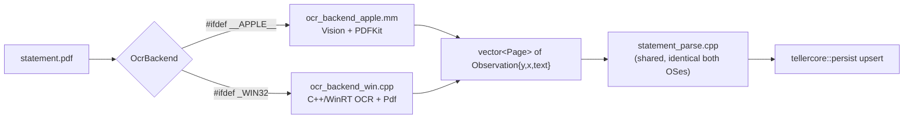

## OCR Backend + Shared Statement Parser in tellercore

### Core idea
Split [08_backfill_bank_statements.py](08_backfill_bank_statements.py) at the `Observation` boundary. Everything downstream of OCR (the ~350 lines of parsing) becomes one shared, platform-agnostic C++ source. Only OCR capture + PDF rasterization is per-platform, behind one interface.



### New module layout (under [src/core](src/core))
- `include/tellercore/ocr.hpp` - `Observation`, `Page`, `OcrBackend` interface, `make_ocr_backend()` factory.
- `include/tellercore/statement.hpp` - parsing API (`reconstruct_lines`, `parse_transactions`, `make_txn_id`, summary/last-four helpers, `StatementTxn` struct).
- `src/ocr_backend_apple.mm` - Objective-C++ Vision/PDFKit backend (`#ifdef __APPLE__`).
- `src/ocr_backend_win.cpp` - C++/WinRT backend (`#ifdef _WIN32`, stubbed/guarded until Windows work begins).
- `src/statement.cpp` - the shared parser (port of 08 lines 32-319).
- `tools/teller_backfill.cpp` - CLI port of 08's `main`/institution loop.
- `tests/test_statement.cpp` - unit tests from canned `Observation` fixtures.
- `oracle/statement_scenarios.json` + a `--replay-statements` mode for the parity lane.

### The Observation contract (ocr.hpp sketch)
The single normalization point. Every backend must emit `y`/`x` in the same normalized [0,1] space, origin bottom-left, matching what Vision returns today (08 line 108 uses `boundingBox.midY`/`minX`), so the shared `reconstruct_lines` epsilon (08 lines 46-63) stays tuned once.

```cpp
namespace tellercore::ocr {
struct Observation {
  double y;            // normalized midY in [0,1], origin bottom-left
  double x;            // normalized minX in [0,1]
  std::string text;    // trimmed, tab-stripped recognized text
};
using Page = std::vector<Observation>;

class OcrBackend {
 public:
  virtual ~OcrBackend() = default;
  // Rasterize + OCR a PDF; one Page per source page, in page order.
  virtual std::vector<Page> recognize(const std::filesystem::path& pdf) = 0;
};

// Returns the compiled-in platform backend (Apple now, WinRT later).
std::unique_ptr<OcrBackend> make_ocr_backend();
}
```

### macOS backend (ocr_backend_apple.mm)
Replaces the inline Swift snippet (08 lines 86-121) and the `pdftoppm` shell-out (08 lines 152-158) with native calls returning C++ structs directly - no `swift -e`, no subprocess, no temp PNGs:
- PDFKit `PDFDocument`/`PDFPage` -> render each page to `CGImage` (replaces `pdftoppm -r 300`).
- Vision `VNRecognizeTextRequest` (`.accurate`, `usesLanguageCorrection = false`) per page; for each `VNRecognizedTextObservation` push `{boundingBox.midY, boundingBox.minX, topCandidates(1).string}` into the page's `Page`. This is already Vision's coordinate space, so no remapping.
- Compiled as Objective-C++; links `-framework Vision -framework PDFKit -framework AppKit -framework CoreGraphics`.

### Windows backend (ocr_backend_win.cpp) - interface-complete, deferred body
- `Windows.Data.Pdf.PdfDocument` -> `PdfPage.RenderToStreamAsync` -> `SoftwareBitmap` (replaces rasterization).
- `Windows.Media.Ocr.OcrEngine.RecognizeAsync` returns `OcrLine`/`OcrWord` with **pixel** bounding boxes. Normalization step (the one place Windows differs): divide by page pixel width/height and flip Y (`1 - yPixel/height`) so output matches Vision's bottom-left [0,1] contract. Word-level boxes feed the same `Observation` list; `reconstruct_lines` reclusters them, so per-engine clustering can be tuned here only if needed.
- Built with C++/WinRT; only this file is `#ifdef _WIN32`.

### Shared parser (statement.cpp) - direct port of 08
One file, compiled identically on both OSes:
- `reconstruct_lines` + `_adaptive_line_epsilon` (08 lines 46-80) over `Observation`s.
- The regex zoo (08 lines 32-42) via `std::regex`; amount/sign/type inference, `_find_amount`, line merging/grouping, `_transaction_from_group` (08 lines 182-319).
- `_rescue_buried_interest`, `extract_statement_year`, `extract_summary`, last-four matching (08 lines 160-179, 296-398).
- `make_txn_id` (08 lines 322-325): `"stmt_" + lower-hex(sha256(account|date|amount|description|occurrence))[:20]` using OpenSSL EVP - already linked. Note: this requires `TELLERCORE_ENABLE_HTTP=ON` (the only thing currently pulling in OpenSSL in [src/core/CMakeLists.txt](src/core/CMakeLists.txt) lines 67-93); the plan moves the OpenSSL `find_package` out of the HTTP block so statement parsing can hash independent of the HTTP option.
- Output struct `StatementTxn { date, amount (signed decimal string), description, type }`, matching the dict 08 builds at lines 274-279.

### Persistence + CLI (teller_backfill.cpp)
- Expose a public `persist::upsert_statement_transactions(db, account_id, txns)` wrapping the currently-internal `upsert_transaction` ([src/core/src/persist.cpp](src/core/src/persist.cpp) line 345) in a `db::Transaction`. Reuses `money_to_cents`, the API-overlap skip (08 lines 453-467: skip dates >= earliest `txn_%` date), and per-(date,amount,description) occurrence counting (08 lines 461-464).
- CLI mirrors 08 flags: `--institution-id`, `--account-id`, `--statements-root`, `--dry-run`, `--debug`; discovers PDFs, matches statements to accounts via override/single-account/last-four, logs summary-vs-parsed reconciliation (08 lines 422-449).

### CMake wiring ([src/core/CMakeLists.txt](src/core/CMakeLists.txt))
- Add `src/statement.cpp` always; add `src/ocr_backend_apple.mm` only `if(APPLE)` (enable `OBJCXX` language, link Vision/PDFKit/AppKit/CoreGraphics); `src/ocr_backend_win.cpp` only `if(WIN32)`.
- Move OpenSSL link onto `tellercore` unconditionally (for sha256) instead of HTTP-only.
- New `teller_backfill` executable under `TELLERCORE_BUILD_TOOLS`, gated `if(APPLE OR WIN32)`.

### Testing (the payoff of the Observation boundary)
- `tests/test_statement.cpp`: feed canned `vector<Page>` fixtures (no Vision, no PDFs) and assert reconstructed lines, signed amounts, types, interest rescue, deterministic IDs, last-four extraction. Fully deterministic and cross-platform.
- A `08` parity lane (new `tests/t19_...sh` mirroring [t17](tests/t17_run_python_cpp_oracle_parity_test.sh)): since OCR is nondeterministic, parity runs at the parser boundary - feed identical `Observation`/page-text fixtures to both retired Python 08 functions and the C++ parser, diff the resulting transaction lists + `make_txn_id`s. Keeps Python 08 as the reference oracle exactly like 07/persist.

### Risks already accounted for
- Engine coordinate disagreement -> each backend normalizes to the one `Observation` contract; tuning happens once in `reconstruct_lines`.
- Weak Windows OCR -> Tesseract (C++ API) drops into the same backend slot later with no parser changes.