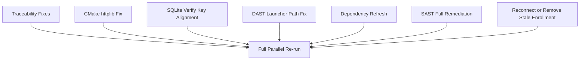

# Fix Parallel Test Failures End-to-End

## Goal
Get `./06_run_all_tests_parallel.sh` back to green without weakening gates, by fixing root causes and preserving existing security/traceability policies.

## Execution Order

## Planned Changes
- **Traceability (`t04`)**
  - Add missing source `#R` tags for `R001..R040` in [`/Users/phil/local/src/eggnest/teller/Makefile`](/Users/phil/local/src/eggnest/teller/Makefile) so it matches [`/Users/phil/local/src/eggnest/teller/requirements/Makefile-requirements.md`](/Users/phil/local/src/eggnest/teller/requirements/Makefile-requirements.md).
  - Keep `R200` and add a matching requirement section/tests in [`/Users/phil/local/src/eggnest/teller/requirements/src/sql/sqlite/create_database-requirements.md`](/Users/phil/local/src/eggnest/teller/requirements/src/sql/sqlite/create_database-requirements.md) for the existing `#R200` tag in [`/Users/phil/local/src/eggnest/teller/src/sql/sqlite/create_database.sql`](/Users/phil/local/src/eggnest/teller/src/sql/sqlite/create_database.sql).

- **C++ oracle parity configure failure (`t17`)**
  - In [`/Users/phil/local/src/eggnest/teller/src/core/CMakeLists.txt`](/Users/phil/local/src/eggnest/teller/src/core/CMakeLists.txt), set `HTTPLIB_INSTALL OFF` before `FetchContent_MakeAvailable(httplib)` to prevent CPack install-path failures during parity lane configure.

- **SQLite deploy verification mismatch (`t05`)**
  - In [`/Users/phil/local/src/eggnest/teller/tests/t05_deploy_database_verification_test.sh`](/Users/phil/local/src/eggnest/teller/tests/t05_deploy_database_verification_test.sh), align key/path precedence with deploy/test conventions:
    - key: `TELLER_DB_SQLCIPHER_KEY` -> `SQLCIPHER_KEY` -> profile helper
    - path: `TELLER_DB_SQLITE_PATH` -> `SQLITE_PATH`
  - Add explicit wrong-key diagnostics (distinguish bad SQLCipher key from genuinely missing tables/views).

- **DAST lane launcher path (`t11`)**
  - Update stale `DAST_APP_SCRIPT` in [`/Users/phil/local/src/eggnest/runner/config/runbook/teller.env`](/Users/phil/local/src/eggnest/runner/config/runbook/teller.env) from retired classy path to `../classy/src/core/scripts/launch_dast_targets.py`.
  - Update stale DAST/classification references in [`/Users/phil/local/src/eggnest/teller/README.md`](/Users/phil/local/src/eggnest/teller/README.md) where they still point to retired scripts.

- **Dependency freshness (`t02`)**
  - Bump direct stale dependency pin in [`/Users/phil/local/src/eggnest/teller/requirements.in`](/Users/phil/local/src/eggnest/teller/requirements.in): `starlette==1.3.1`.
  - Regenerate lockfile (`requirements.txt`) via the existing supply-chain script flow so `pytest` lock resolves to latest allowed version and freshness gate clears.

- **Static security gate (`t03`) full remediation**
  - Fix Bandit medium finding (B608) in [`/Users/phil/local/src/eggnest/teller/src/core/oracle/compare_oracle.py`](/Users/phil/local/src/eggnest/teller/src/core/oracle/compare_oracle.py) by removing string-built SQL execution pattern.
  - Fix cppcheck medium findings by initializing members in:
    - [`/Users/phil/local/src/eggnest/teller/src/core/src/statement.cpp`](/Users/phil/local/src/eggnest/teller/src/core/src/statement.cpp)
    - [`/Users/phil/local/src/eggnest/teller/src/core/include/tellercore/mailcart.hpp`](/Users/phil/local/src/eggnest/teller/src/core/include/tellercore/mailcart.hpp)
    - [`/Users/phil/local/src/eggnest/teller/src/core/tools/teller_fetch.cpp`](/Users/phil/local/src/eggnest/teller/src/core/tools/teller_fetch.cpp)
  - Remediate clang-tidy medium+ backlog in project-owned C++ (`src/core`) with priority on:
    - `bugprone-unchecked-optional-access`
    - `cert-err33-c`
    - `bugprone-exception-escape`
    - `concurrency-mt-unsafe`
    - `bugprone-throwing-static-initialization` (convert fragile static-init patterns to safe alternatives)
  - Keep gate strict (no policy downgrades).

- **Live upstream checks (`t12`, `t13`)**
  - Resolve local disconnected enrollment causing `first_ak_bank_trust` 404s by reconnecting that enrollment in classy Connect or removing stale local `~/.teller` token/enrollment files for that suffix.
  - Keep strict canary behavior unchanged; this is a local enrollment health issue, not API-contract drift.

## Validation Plan
- Run targeted lanes in this order to shorten feedback loops: `t04 -> t17 -> t05 -> t11 -> t02 -> t03 -> t12 -> t13`.
- Re-run full aggregate: [`/Users/phil/local/src/eggnest/teller/06_run_all_tests_parallel.sh`](/Users/phil/local/src/eggnest/teller/06_run_all_tests_parallel.sh).
- Confirm no regressions in previously passing C++ lanes (`t15`, `t16`, `t18`, `t19`).