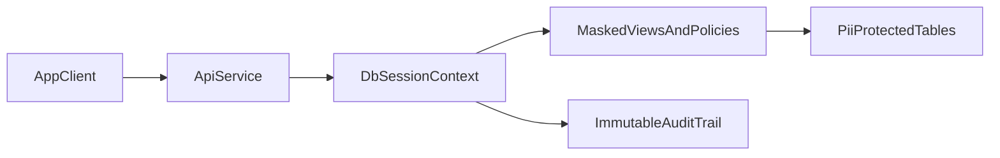

# Postgres Security Hardening Plan (Pre-Prod)

## Current State (from repo)
- Role separation and default grants are already present in [`/Users/phil/local/src/teller/src/sql/postgres/configure_database.sql`](/Users/phil/local/src/teller/src/sql/postgres/configure_database.sql) (`teller_read`, `teller_write`, `teller_admin`).
- Row-change auditing exists via triggers in [`/Users/phil/local/src/teller/src/sql/postgres/create_audit.sql`](/Users/phil/local/src/teller/src/sql/postgres/create_audit.sql).
- Sensitive PII currently appears stored in plaintext columns such as:
  - [`/Users/phil/local/src/teller/src/sql/postgres/teller_account_details.sql`](/Users/phil/local/src/teller/src/sql/postgres/teller_account_details.sql) (`account_number`)
  - [`/Users/phil/local/src/teller/src/sql/postgres/teller_identity_email.sql`](/Users/phil/local/src/teller/src/sql/postgres/teller_identity_email.sql) (`data`)
  - [`/Users/phil/local/src/teller/src/sql/postgres/teller_identity_phone_number.sql`](/Users/phil/local/src/teller/src/sql/postgres/teller_identity_phone_number.sql) (`data`)
  - [`/Users/phil/local/src/teller/src/sql/postgres/teller_identity_address_data.sql`](/Users/phil/local/src/teller/src/sql/postgres/teller_identity_address_data.sql) (`street`, `postal_code`, etc.)
- No explicit RLS policies were found in Postgres SQL under [`/Users/phil/local/src/teller/src/sql/postgres`](/Users/phil/local/src/teller/src/sql/postgres).

## Target Control Set (SOC 2 + PCI + GLBA baseline)
- Encrypt data at rest with cloud-managed disk/database encryption (CMEK where available).
- Encrypt in transit with TLS 1.2+ and verify `sslmode=verify-full` from all app clients.
- Minimize direct table access; expose least-privilege views/functions for app read paths.
- Implement row-level security as defense-in-depth for role-based/service-scoped data access in a single-tenant system.
- Protect PII with tokenization/masking and deterministic hashing for lookup columns.
- Strengthen auditing with immutable, actor-attributed audit trails and privileged-access logs.
- Enforce retention + deletion controls (PII minimization, account closure lifecycle).

## Phased Implementation

### Phase 1: Foundation Hardening (must-do before production)
- Enforce TLS-only DB connections and certificate validation in DB profile config and runtime checks (profile handling in [`/Users/phil/local/src/teller/src/teller/teller_db_profile.py`](/Users/phil/local/src/teller/src/teller/teller_db_profile.py)).
- Remove broad inheritance from application login role where possible; replace with explicit grants for specific schemas/objects in [`/Users/phil/local/src/teller/src/sql/postgres/configure_database.sql`](/Users/phil/local/src/teller/src/sql/postgres/configure_database.sql).
- Split runtime identities by function (ingest-writer, api-reader, api-writer, migration-admin); stop using one shared high-capability role for all paths.
- Create a security schema migration file for centralized hardening DDL (RLS enablement, policies, masked views, function grants).

### Phase 2: PII Protection Model
- Classify table/column sensitivity (Public, Internal, Confidential, Restricted-PII) and codify as docs + tests.
- For `account_number`, emails, phone numbers, addresses:
  - Store a tokenized or encrypted canonical value.
  - Store a normalized deterministic hash column for equality search/dedup.
  - Expose redacted values in app-facing views (for example `****1234`, masked email local-part).
- Keep encryption keys outside Postgres (KMS/HSM); do not hardcode app-layer encryption keys in repo or DB.
- Add constraints/functions to prevent accidental plaintext inserts into protected columns.

### Phase 3: Row-Level Security in a Single-Tenant Model
- Keep the schema single-tenant; do not introduce tenant IDs solely for RLS.
- `ALTER TABLE ... ENABLE ROW LEVEL SECURITY` on high-risk tables (transactions, account details, identities, matching tables) to enforce service-role and operation boundaries.
- Define policies for read/write by DB role and session attributes (for example service identity and request context set by API middleware).
- Add fail-closed behavior (`FORCE ROW LEVEL SECURITY` where appropriate) and regression tests proving disallowed cross-role reads/writes are denied.

### Phase 4: Audit, Detection, and Compliance Evidence
- Extend auditing beyond row DML:
  - Log privileged role use, failed auth, DDL changes, grant changes.
  - Include request/user correlation IDs passed from API to DB session context.
- Add immutable audit export pipeline (WORM-capable object storage) and retention policy.
- Build compliance evidence checks in existing security lanes:
  - Assert RLS enabled on required tables.
  - Assert plaintext PII columns are absent/restricted.
  - Assert TLS settings and role grants match policy.

## Suggested Data-Flow Model

## Acceptance Criteria (pre-prod exit)
- No customer PII fields are stored as unrestricted plaintext in production tables.
- RLS is enabled and policy-tested on all high-risk PII/financial tables for role-based restrictions.
- Application roles cannot bypass least-privilege boundaries.
- All DB connections enforce verified TLS.
- Audit logs support forensic reconstruction of who accessed/changed sensitive records.
- Security test lanes fail when any of the above controls regress.

## Immediate Next Steps (1-2 week sprint)
- Draft a PII column inventory and classification matrix from current `teller.*` schema.
- Design target role matrix and single-tenant RLS policy map per table.
- Add first migration set for role split + RLS on highest-risk tables (`account_details`, identity tables, transactions) with role-based enforcement tests.