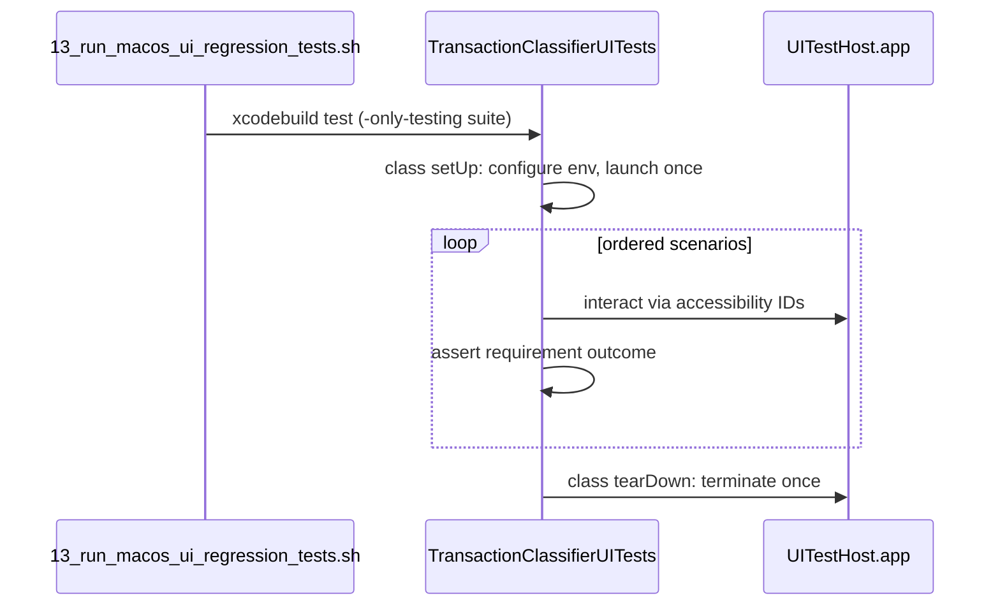

# Redo Script 10: Single-Session UI Regression

## Problem

`[13_run_macos_ui_regression_tests.sh](13_run_macos_ui_regression_tests.sh)` orchestrates two lanes correctly (snapshots pass), but the XCUITest lane is broken and obsolete:

1. **Build failure**: Xcode test host is missing `[AppActivation.swift](macos-ui/Sources/TransactionClassifier/AppActivation.swift)` (and likely `[EmailAmountScrollSupport.swift](macos-ui/Sources/TransactionClassifier/EmailAmountScrollSupport.swift)`) from `[project.pbxproj](macos-ui/TransactionClassifierUIAutomation.xcodeproj/project.pbxproj)` — SPM builds fine, Xcode does not.
2. **UI drift**: Tests assert old copy/structure (`Assigned: Dining`, `Teller Category: food`, list/detail split) but the app is now a **TabView** with a **3-pane Match & Classify** layout (`[ContentView.swift](macos-ui/Sources/TransactionClassifier/ContentView.swift)`).
3. **Architecture mismatch**: `[TransactionClassifierUITests.swift](macos-ui/UITests/TransactionClassifierUITests.swift)` launches a fresh app in `setUpWithError` for every method (13 launches per run); you want **one robust launch → full automation → one teardown**.

Snapshot lane stays as-is (already green and still valuable for layout regressions).

---

## Target Architecture

**Single-session pattern** (recommended over 13 `setUpWithError` launches):

- `override class func setUp()` — create/configure `XCUIApplication`, set launch args/env, `launch()` once.
- **One** test method, e.g. `testMacOSUISmokeSuite()`, that calls private scenario functions in a fixed order.
- `override class func tearDown()` — `terminate()` once.
- Use **accessibility identifiers** (already present in views) instead of brittle static text like `Assigned: …`.

**Launch configuration** (set once in class setUp):

| Env / arg                                | Value     | Why                                                                    |
| ---------------------------------------- | --------- | ---------------------------------------------------------------------- |
| `--ui-testing` / `TELLER_UI_TEST_MODE=1` | on        | fixture APIs                                                           |
| `TELLER_UI_TEST_PAGE_SIZE`               | `20`      | all 18 fixture rows load for scroll (#R025) without mid-suite relaunch |
| optional API/proxy env                   | forwarded | preserve existing R035 override behavior                               |

**Trade-off**: `TELLER_UI_TEST_PAGE_SIZE=20` means pagination/load-more cannot be exercised in the same session (button disabled when all rows fit). Load-more pagination is already covered by unit tests + fixture API; drop it from XCUITest smoke rather than relaunching mid-suite.

---

## Scenario Matrix (derived from requirements)

Rebuild scenarios from macos-ui requirement docs, not from the old 13-method list.

| Step | Source req                    | Scenario                                   | Key assertions (accessibility-first)                                                                                                     |
| ---- | ----------------------------- | ------------------------------------------ | ---------------------------------------------------------------------------------------------------------------------------------------- |
| 1    | ContentView R001              | Match & Classify shell loads               | `match-and-classify-tab`, `match-and-classify-split`, `transaction-list`, first row visible                                              |
| 2    | ContentView R005              | Search narrows list                        | `search-field` → type `coffee` → `transaction-description-txn_001` exists                                                                |
| 3    | ContentView R020              | Unclassified filter default + auto-refresh | `only-unclassified-toggle` on → Coffee visible, Utility hidden; toggle off → `Electric Utility Co` appears without `refresh-button`      |
| 4    | ContentView R030              | Selection shows txn id                     | click Coffee → `selected-transaction-header` contains `txn_001`                                                                          |
| 5    | ContentView R010              | Next unclassified shortcut                 | disable filter, select Utility, `Cmd+]` → selection moves to `txn_001` (header/row id)                                                   |
| 6    | ContentView R015              | Apply category                             | typeahead + `apply-selected-button` → `selected-assigned-category` / `transaction-classification-txn_001` shows Dining                   |
| 7    | ContentView R015              | Undo                                       | `Cmd+Z` → classification returns to Unclassified                                                                                         |
| 8    | ContentView R015              | Undo restores prior on classified row      | reclassify Utility → Dining, undo → Utilities restored                                                                                   |
| 9    | ContentView R025              | Scroll into view on next unclassified      | scroll `transaction-list` until `transaction-row-txn_001` not hittable, `Cmd+]` → row hittable again                                     |
| 10   | TransactionClassifierApp R035 | Help menu shortcuts                        | Help → all 6 shortcut labels present                                                                                                     |
| 11   | ConnectView R025/R020         | Connect tab loads + manual save            | switch to Connect tab → `connect-context-list`, fill `connect-token-field`, `connect-manual-save-button` → `connect-status-text` updates |
| 12   | ContentView R010 (connect)    | Connect tab hides Next Unclassified        | on Connect tab, `next-unclassified-button` absent                                                                                        |

**Explicitly out of XCUITest smoke** (keep in unit/snapshot lanes):

- ContentView R035 email amount scroll (WebView timing; unit-tested)
- ContentView R040 category bulk delete (Manage Categories tab — add later if needed)
- ContentView R045 clear match (fixture API has no `match` data today)
- ConnectView R015 WebView Teller Connect flow (too heavy/flaky for smoke)

---

## File Changes

### 1. Fix Xcode test host parity — `[project.pbxproj](macos-ui/TransactionClassifierUIAutomation.xcodeproj/project.pbxproj)`

Add missing SPM source files to `TransactionClassifierUITestHost` target:

- `AppActivation.swift` (required — current build blocker)
- `EmailAmountScrollSupport.swift` (referenced by ContentView email scroll)

Verify `xcodebuild test` compiles before rewriting tests.

### 2. Rewrite XCUITests — `[TransactionClassifierUITests.swift](macos-ui/UITests/TransactionClassifierUITests.swift)`

Replace per-method `setUpWithError` + 13 `test`* methods with:

- `TransactionClassifierUISession` helper (static app, `uiElement(_:)`, waits, tab navigation via `match-and-classify-tab` / Connect tab button)
- Scenario functions (`runSearchFilterScenario()`, etc.) mapped to requirement tags in comments
- Single entry point `testMacOSUISmokeSuite()`
- Optional: read `XCUITEST_STEPS` env (comma/range, same parser logic as script) to run subset of scenarios **within the same launched session** for local debugging — avoids maintaining 12 separate XCTest methods

Update assertions to current UI:

- `Current: Dining` via `selected-assigned-category` (not `Assigned: Dining`)
- `Unclassified` / `Utilities` via `transaction-classification-`* (not `Teller Category: food`)
- `status-text` for save confirmations (keep `Saved N classification(s)` where still emitted)
- Connect navigation via tab bar + `connect-token-field` (not `secureTextFields.firstMatch`)

### 3. Update runner script — `[13_run_macos_ui_regression_tests.sh](13_run_macos_ui_regression_tests.sh)`

- Replace `XCUITEST_METHODS` array with `XCUITEST_SCENARIOS` (12 step names above)
- Default invocation: `-only-testing:TransactionClassifierUITests/TransactionClassifierUITests/testMacOSUISmokeSuite`
- When positional selector provided: validate against scenario list, export `XCUITEST_STEPS=…` to xcodebuild env instead of multiple `-only-testing` args
- Keep all existing env gates (`RUN_SNAPSHOT_TESTS`, `RUN_XCUITESTS`, `XCUITEST_PROJECT`, etc.)

### 4. Update requirements — `[requirements/13_run_macos_ui_regression_tests-requirements.md](requirements/13_run_macos_ui_regression_tests-requirements.md)`

- Revise **R040/R045** to describe scenario-step selection inside the single smoke suite (not per-XCTest-method `-only-testing` entries)
- Add changelog entry noting UI rework + single-session model
- Cross-reference macos-ui requirement IDs that drive scenario content

### 5. Update bats tests — `[tests/sh/13_run_macos_ui_regression_tests.bats](tests/sh/13_run_macos_ui_regression_tests.bats)`

- R040 test: verify `XCUITEST_STEPS` exported and single `-only-testing:…/testMacOSUISmokeSuite` (not 4 separate method entries)
- R045 test: update valid range to 12
- Other tests (R001, R005, R010, etc.): minimal changes — stub behavior unchanged

### 6. Doc touch-up — `[macos-ui/README.md](macos-ui/README.md)`

- Update XCUITest description: single-session smoke suite, scenario list, optional `XCUITEST_STEPS`
- Fix default scheme doc drift (`TransactionClassifierUITestHost-CI` vs `TransactionClassifierUITestHost`)

---

## Verification

1. `xcodebuild test -project macos-ui/TransactionClassifierUIAutomation.xcodeproj -scheme TransactionClassifierUITestHost-CI -destination 'platform=macOS' -only-testing:TransactionClassifierUITests/TransactionClassifierUITests/testMacOSUISmokeSuite` — passes
2. `./13_run_macos_ui_regression_tests.sh` — snapshot + XCUITest green
3. `./13_run_macos_ui_regression_tests.sh 3,6` — runs subset via `XCUITEST_STEPS` without relaunching between steps
4. `bats tests/sh/13_run_macos_ui_regression_tests.bats` — all requirement-tagged tests pass

---

## Risk Notes

- **Stateful ordering**: scenarios must run in dependency order (e.g. apply before undo). Single test method enforces this; document order in code.
- **Flaky scroll (#R025)**: keep hittability polling + generous timeouts; same technique as today but using `transaction-row-`* identifiers.
- **Tab switching**: prefer TabView tab buttons (`Match & Classify`, `Connect`) with fallback to accessibility identifiers; remove Connect-only launch env (`TELLER_MACOS_START_TAB`) since single session navigates in-app.

