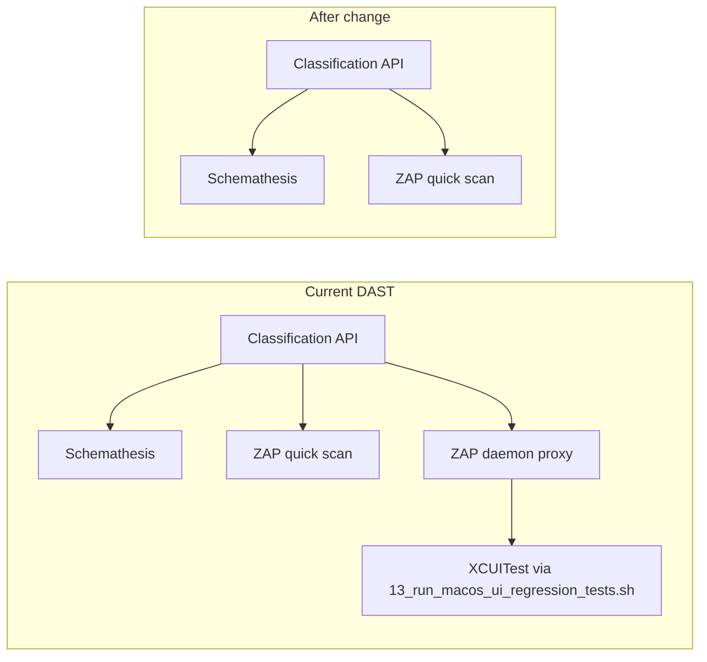

# Remove macOS UI automation from DAST

## Context

`[16_run_dast.sh](16_run_dast.sh)` currently runs three DAST layers after starting the classification API:

1. **Schemathesis** (OpenAPI contract fuzzing)
2. **OWASP ZAP quick scan** (CLI against `/health`)
3. **macOS UI DAST** — ZAP daemon proxy + `./13_run_macos_ui_regression_tests.sh` with `RUN_XCUITESTS=true` (this is what failed on the missing `activateTransactionClassifierForInput` symbol and what you want removed)

The same macOS UI block is **duplicated** in `[06_run_static_security_tests.sh](06_run_static_security_tests.sh)` when `RUN_DAST=true` (off by default). Both copies should be removed so the feature cannot be re-enabled accidentally.

**Out of scope (unchanged):**

- `[13_run_macos_ui_regression_tests.sh](13_run_macos_ui_regression_tests.sh)` and all `macos-ui/` snapshot/XCUITest code
- Swift SAST (`RUN_SWIFT_SAST`) inside `16_run_dast.sh`
- Schemathesis, ZAP quick scan, category integrity checks, token-capture deprecation messages




## Implementation

### 1. `[16_run_dast.sh](16_run_dast.sh)`

Delete the entire macOS UI DAST block (~lines 1386–1482): `RUN_MACOS_UI_DAST`, proxy host/port selection, ZAP `-daemon`, invocation of `13_run_macos_ui_regression_tests.sh`, and `zap-macos-ui.{json,html,log}` artifact collection.

**Also remove/simplify related plumbing:**


| Item                                                                                                         | Action                                                                                                            |
| ------------------------------------------------------------------------------------------------------------ | ----------------------------------------------------------------------------------------------------------------- |
| `run_macos_ui_dast`, `macos_ui_dast_proxy_*`, `zap_api_url`, `zap_alerts_api_url`, `zap_html_report_api_url` | Remove                                                                                                            |
| `zap_proxy_pid` + trap cleanup for it                                                                        | Remove from trap (keep `classifier_api_pid` / `token_capture_pid`)                                                |
| `zap_daemon_home_dir` + `mkdir` for daemon                                                                   | Remove; keep `zap_quick_home_dir` only                                                                            |
| `print_zap_startup_log_tail`                                                                                 | Remove (only used for daemon startup failures)                                                                    |
| ZAP alert loop                                                                                               | Drop `zap-macos-ui.json` from the `for zap_json in ...` list and the “no JSON files” branch                       |
| Comment on `is_tcp_port_in_use` (R025)                                                                       | Reword — port helpers remain for **API** (`DAST_BASE_PORT`) and **ZAP quick-scan proxy** (`ZAP_QUICK_PROXY_PORT`) |


**Env var rename (small cleanup while touching this code):**

- Replace `MACOS_UI_DAST_REUSE_EXISTING_API` with `DAST_REUSE_EXISTING_API` (same behavior: skip starting `14_run_classification_api.py` when `true`).
- Accept legacy `MACOS_UI_DAST_REUSE_EXISTING_API` as a fallback for one release if you want zero breakage for any local scripts; otherwise document-only removal is fine.

Remove all `RUN_MACOS_UI_DAST`, `MACOS_UI_DAST_ZAP_PROXY_*` references.

### 2. `[06_run_static_security_tests.sh](06_run_static_security_tests.sh)`

Mirror the same deletion inside `run_dast_checks()` (~~lines 1167–1222) and the `zap-macos-ui.json` references in the DAST gating loop (~~1242, 1271). Apply the same `DAST_REUSE_EXISTING_API` rename for consistency.

### 3. Requirements — `[requirements/16_run_dast-requirements.md](requirements/16_run_dast-requirements.md)`

Remove requirements that exist only for the macOS UI ZAP daemon lane:

- **R025** — macOS UI proxy port contention
- **R030** — separate quick-scan vs daemon ZAP homes
- **R035** — ZAP daemon startup log tail

Retain **R001, R005, R010, R015, R020** (banner, strict shell, venv, default DAST lane, completion output).

Add changelog entry: removed macOS UI / XCUITest DAST integration (2026-05-19).

No changes needed in `[requirements/06_run_static_security_tests-requirements.md](requirements/06_run_static_security_tests-requirements.md)` (macOS UI DAST was never specified there).

### 4. Bats tests

`**[tests/sh/16_run_dast.bats](tests/sh/16_run_dast.bats)`**

- Delete tests: `macOS UI DAST auto-selects proxy port...`, `macOS UI DAST rejects non-numeric proxy port...`, `DAST uses isolated ZAP homes for quick scan and daemon lanes`, `DAST script includes explicit ZAP daemon startup diagnostics`
- Delete helpers only used by those tests: `write_macos_ui_regression_stub`, `stub_curl_health_and_zap_alerts` (if unused afterward)
- Update traceability header comments (`#R025`, `#R030`, `#R035` anchors)
- In remaining tests, drop `RUN_MACOS_UI_DAST=false` from `env` (no longer meaningful)

`**[tests/sh/06_run_static_security_tests.bats](tests/sh/06_run_static_security_tests.bats)`**

- Delete: `macOS UI DAST requires RUN_ZAP=true`, `macOS UI DAST runs regression through proxy and writes artifacts`
- Remove `RUN_MACOS_UI_DAST=false` from surviving DAST tests

### 5. Documentation

- `[README.md](README.md)`: Remove `RUN_MACOS_UI_DAST`, `MACOS_UI_DAST_ZAP_PROXY_*`, macOS UI DAST example block (~lines 188–199); document `DAST_REUSE_EXISTING_API` if kept/renamed
- `[macos-ui/README.md](macos-ui/README.md)`: Remove line 88 (`RUN_SAST=false RUN_MACOS_UI_DAST=true ./16_run_dast.sh`); verification helpers should list only `./13_run_macos_ui_regression_tests.sh` for UI testing

## Verification

After implementation:

```bash
bats tests/sh/16_run_dast.bats tests/sh/06_run_static_security_tests.bats
```

Optional manual smoke (should no longer build Xcode or mention XCUITest):

```bash
RUN_SAST=false RUN_SCHEMATHESIS=false ./16_run_dast.sh
```

Expect: Schemathesis + ZAP quick scan + category integrity; **no** “Running macOS UI XCUITest smoke suite through ZAP proxy”.

## Note on your Schemathesis failures

The 4 Schemathesis failures in your log (502 on malformed message id, 422/400 on matchy candidate endpoints) are **separate** from this removal. This change only eliminates the UI automation gate that blocked DAST completion; it does not fix API contract issues.