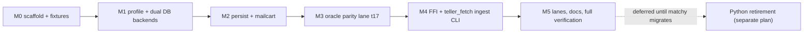

# Teller Python → C++ Core Migration

Replicate classy's migration pattern in teller, with two deltas: the C++ core supports **both SQLite/SQLCipher and PostgreSQL (libpq)**, and **Python is not deleted** at the end — matchy still imports `teller.teller_db` / `teller_db_profile`, so Python and C++ coexist until matchy migrates (oracle-retirement is a deferred follow-up plan).

Reference implementations to crib from: classy's [src/core/CMakeLists.txt](../classy/src/core/CMakeLists.txt), `profile.cpp`/`db.hpp` (already replicate teller's sqlite profile + open semantics), `ffi.cpp` JSON-op dispatch, `oracle_runner.cpp` + `compare_oracle.py`, and lanes t15–t17.

## What gets ported

- [src/teller/teller_db_profile.py](src/teller/teller_db_profile.py) (450 ln) → `core/src/profile.cpp` — full resolution incl. Postgres profiles, env overrides, 1psa field lookup via `dlopen("libonepsa.dylib")` (replaces ctypes).
- [src/teller/teller_db.py](src/teller/teller_db.py) (257 ln) → `core/src/db.cpp` — backend interface with `SqlCipherDb` (`:memory:` + `PRAGMA key` + `ATTACH ... AS teller`, FK on) and `PostgresDb` (libpq, sslmode from profile).
- [src/teller/teller_persist.py](src/teller/teller_persist.py) (476 ln) → `core/src/persist.cpp` — idempotent upserts (institutions, accounts, identity graph, transactions, balances, stale-pending cleanup), single commit boundary, dialect-aware ON CONFLICT SQL.
- [src/teller/teller_mailcart_client.py](src/teller/teller_mailcart_client.py) (153 ln) → `core/src/mailcart.cpp` (classy's mailcart.cpp is the template).
- ORM models/enums (~400 ln across 20 files) → no ORM in C++; enums become `enum class`, hydration becomes JSON→row mapping inside persist.
- [07_fetch_teller_api_data.py](07_fetch_teller_api_data.py) (402 ln) → `core/src/ingest.cpp` + CLI tool `teller_fetch` — cpp-httplib SSL client with mTLS (cert/key from `~/.teller/`), token Basic auth, pagination, then persist via core.
- **Stays Python**: [08_backfill_bank_statements.py](08_backfill_bank_statements.py) (OCR backfill — still needed; fix the erroneous "deprecated" labels in README.md), `src/scripts/*` operational checks, and the whole `src/teller` package (matchy dependency).

## M0 — Scaffold and fixtures

- `src/core/CMakeLists.txt`: C++20, `-Wall -Wextra -Wpedantic -Werror`, FetchContent nlohmann::json + Catch2 + cpp-httplib, brew SQLCipher discovery (classy pattern), `find_package(PostgreSQL)` for libpq, OpenSSL. Options mirroring classy: `TELLERCORE_BUILD_TESTS/TOOLS`, `TELLERCORE_SANITIZE`, plus `TELLERCORE_ENABLE_POSTGRES` (default ON, OFF possible for future mobile reuse).
- Static lib `tellercore`; test fixture builds a temp SQLCipher DB from [src/sql/sqlite/create_database.sql](src/sql/sqlite/create_database.sql) + a deterministic `core/oracle/seed_fixture.sql`; Postgres tests use a scratch database created from [src/sql/postgres/](src/sql/postgres) DDL when a local server is reachable (skip otherwise).
- Add root `Makefile` (thin facades, classy R060 style): `core`, `test`, `sanitize`, `parity`.

## M1 — Profile + DB backends

- Port profile resolution with unit tests covering the cases in [tests/py/test_teller_db_profile.py](tests/py/test_teller_db_profile.py) (env overrides, profile file search order, 1psa-backed fields, `~/.env` password fallback).
- Implement both DB backends behind one interface (exec, query-as-json, transaction scope). Catch2 tests for open semantics, FK enforcement, integer-cents convention on SQLite.

## M2 — Persist + mailcart

- Port `persist_all` and friends; tests mirror [tests/py/test_teller_persist.py](tests/py/test_teller_persist.py) on both backends (Postgres cases auto-skip without a server).
- Port mailcart client (token auth, error mapping to status/message like `MailcartError`).

## M3 — Oracle parity (Python vs C++)

- `core/tools/oracle_runner.cpp`: single-op mode (`teller_oracle_runner --backend sqlite|postgres --db ... <op> [json]`) exposing persist/profile/mailcart ops.
- `core/oracle/compare_oracle.py`: builds identical fixtures, runs each scenario through the Python library and the C++ runner, normalizes (timestamps, float rounding, error shapes), diffs with a known-divergence allowlist. Parity matrix: Python-sqlite vs C++-sqlite, and Python-postgres vs C++-postgres when a server is present.
- Scenario set: full `persist_all` payloads (fresh insert, idempotent re-run, updates, stale pending cleanup), identity graph, balances, profile resolution outputs.
- Lane `tests/t17_run_python_cpp_oracle_parity_test.sh` (self-contained, classy style) + `make parity`. Goldens are NOT frozen and Python is NOT deleted in this plan — that's the deferred retirement plan, blocked on matchy.

## M4 — FFI + ingest CLI

- `core/src/ffi.cpp` + `include/tellercore/ffi.h`: `teller_core_open/invoke/free/close`, JSON `{"op", "args"}` → `{"ok", "body"}` / `{"ok": false, "status", "detail"}` envelope (identical contract style to classycore, so matchy/classy can adopt it later).
- `teller_fetch` CLI: mTLS client to `api.teller.io` (`/institutions`, `/accounts`, transactions pagination, balances, identity), normalization, persist via core. Verify against the existing t12 smoke checks; `07_fetch_teller_api_data.py` stays as the reference oracle for ingest parity (one recorded-payload comparison test).

## M5 — Lanes, docs, verification

- New self-contained lanes (no pointer/BATS docs, per classy t15+ convention): `t15_run_cpp_core_unit_tests.sh`, `t16_run_cpp_core_sanitizer_tests.sh` (ASan+UBSan, separate `build-asan/`, `detect_leaks=0`), `t17` parity, `t18_run_cpp_postgres_integration_tests.sh` (requires deployed local Postgres like t05/t06; skips cleanly otherwise).
- Update `README.md` (remove erroneous deprecated markings for 07/08, document C++ core + Makefile) and `Architecture.md` (already stale — reconcile while in there). Add `requirements/Makefile-requirements.md` following classy.
- Runner: [../runner/config/runbook/teller.env](../runner/config/runbook/teller.env) needs no lane removals (Python lanes stay); verify `07_run_all_tests_parallel` discovers the new t15–t18 lanes.
- Final sweep: `make test`, `make sanitize`, `make parity`, t18, then `./06_run_all_tests_parallel.sh` — all existing Python lanes must stay green since Python remains live for matchy.

## Out of scope (deferred to the retirement plan)

- Freezing goldens, deleting `src/teller/`, `tests/py/`, venv, pip supply chain, and Python lane pointers — blocked on matchy's migration off `teller.teller_db`/`teller_db_profile`.
- Porting `08_backfill_bank_statements.py` and `src/scripts/` checkers.